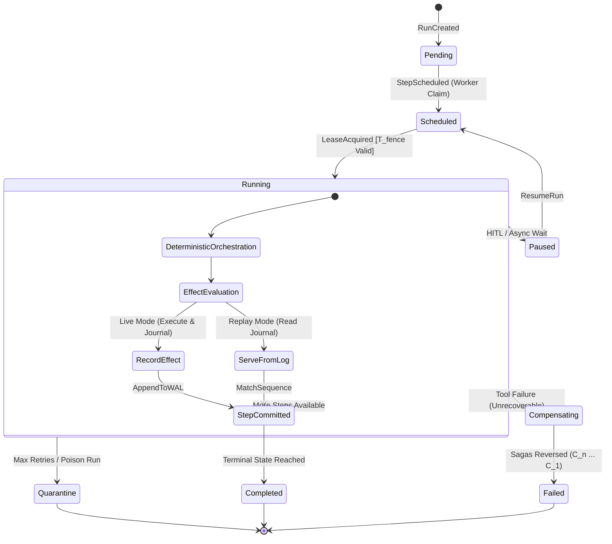
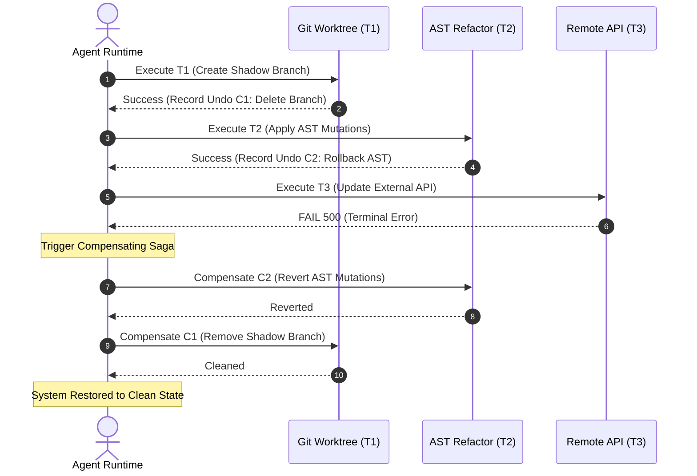
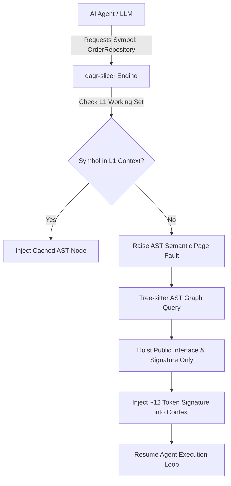

# 🏛️ AI_KEYSTONE: The Agent Operating System Specification & DAGR Synthesis Blueprint

> **Reference Repository:** [`vishalgoyal25/AI_Keystone`](https://github.com/vishalgoyal25/AI_Keystone)  
> **Author & Lead Architect (DAGR):** Mohit Dagar  
> **Classification:** Master Architecture Specification & Applied Research Blueprint  
> **Status:** Approved Architectural Standard  

---

## 📑 Table of Contents
1. [Executive Summary & The "Agent OS" Paradigm](#1-executive-summary--the-agent-os-paradigm)
2. [Comparative Matrix: Operating System Kernels vs. Agent Runtimes](#2-comparative-matrix-operating-system-kernels-vs-agent-runtimes)
3. [Exhaustive 18-Phase Blueprint Breakdown (AI_Keystone)](#3-exhaustive-18-phase-blueprint-breakdown-ai_keystone)
   - [Track 1: Foundation (Phases 0–1)](#track-1-foundation-phases-01)
   - [Track 2: Skeleton (Phase 2)](#track-2-skeleton-phase-2)
   - [Track 3: Runtime Core ⭐ (Phases 3–6)](#track-3-runtime-core--phases-36)
   - [Track 4: Supporting Systems (Phases 7–9)](#track-4-supporting-systems-phases-79)
   - [Track 5: Quality & Observability (Phases 10–12)](#track-5-quality--observability-phases-1012)
   - [Track 6: Platform & Cloud (Phases 13–16)](#track-6-platform--cloud-phases-1316)
   - [Track 7: Production Operations (Phase 17)](#track-7-production-operations-phase-17)
4. [Formal Mathematical & Systems Semantics](#4-formal-mathematical--systems-semantics)
   - [4.1 The Event-Sourced State Fold Algebra & Monotonic Fencing Tokens](#41-the-event-sourced-state-fold-algebra--monotonic-fencing-tokens)
   - [4.2 The Determinism Boundary & Effect Journal Replay Cursor](#42-the-determinism-boundary--effect-journal-replay-cursor)
   - [4.3 Virtual Context Management & Semantic Page Fault Cost Models](#43-virtual-context-management--semantic-page-fault-cost-models)
   - [4.4 Garcia-Molina Distributed Sagas & Backward Compensation Algebra](#44-garcia-molina-distributed-sagas--backward-compensation-algebra)
5. [DAGR × AI_Keystone Master Synthesis Blueprint](#5-dagr--ai_keystone-master-synthesis-blueprint)
   - [5.1 Dual-Plane System Architecture: Hot Rust Path vs. Distributed Cold Path](#51-dual-plane-system-architecture-hot-rust-path-vs-distributed-cold-path)
   - [5.2 AST Semantic Page Faulting (Tree-sitter On-Demand Contract Hoisting)](#52-ast-semantic-page-faulting-tree-sitter-on-demand-contract-hoisting)
   - [5.3 CoW Shadow Sandboxes & Distributed Refactor Sagas](#53-cow-shadow-sandboxes--distributed-refactor-sagas)
   - [5.4 Rust Trait Contracts for Hot Path Agent Execution](#54-rust-trait-contracts-for-hot-path-agent-execution)
   - [5.5 Dual-Track Quality Governance: Contract Tests vs. Trajectory Evals](#55-dual-track-quality-governance-contract-tests-vs-trajectory-evals)
6. [Primary Research Literature & Academic Grounding](#6-primary-research-literature--academic-grounding)

---

## 1. Executive Summary & The "Agent OS" Paradigm

Modern generative AI development is undergoing an architectural phase transition. Building applications by directly chaining LLM API prompts and string interpolations is commoditized, fragile, and fundamentally incapable of hosting autonomous, long-running agentic workloads. When an LLM-based agent operates in production, it suffers from two existential vulnerabilities:

1. **State Amnesia & Process Fragility:** A running agent whose state is kept in ephemeral process memory ceases to exist if the hosting worker crashes, times out, or restarts at step 8 of a 15-step transaction.
2. **Unbounded Non-Deterministic Side Effects:** When an agent calls third-party APIs, mutates codebases, or executes tool side effects without isolation, retries produce duplicate mutations, downstream 500s leave systems in corrupted intermediate states, and token limits force catastrophic context loss.

```
┌──────────────────────────────────────────────────────────────────────────────────────────┐
│                                 THE GOVERNING PARADIGM                                   │
├──────────────────────────────────────────────────────────────────────────────────────────┤
│                                                                                          │
│           ┌──────────────────────────────────────────────────────────────┐               │
│           │            LARGE LANGUAGE MODEL (LLM) == CPU                 │               │
│           │           • Generates reasoning tokens & branches            │               │
│           │           • Stateless, non-deterministic, raw compute        │               │
│           └──────────────────────────────┬───────────────────────────────┘               │
│                                          │                                               │
│                                          ▼                                               │
│           ┌──────────────────────────────────────────────────────────────┐               │
│           │               AGENT RUNTIME == OPERATING SYSTEM              │               │
│           │           • Externalized Process Control Block (PCB)         │               │
│           │           • Write-Ahead Event Sourcing (Crash Recovery)      │               │
│           │           • Protection Rings & Credential Brokering          │               │
│           │           • Virtual Memory Paging & Semantic Faults          │               │
│           │           • Preemptive Scheduling, Aging & Fairness          │               │
│           │           • Compensating Sagas (Distributed Rollbacks)       │               │
│           │           • Trajectory Observability & `strace` Replay       │               │
│           └──────────────────────────────────────────────────────────────┘               │
│                                                                                          │
└──────────────────────────────────────────────────────────────────────────────────────────┘
```

**AI_Keystone** (created by Vishal Goyal) formalizes the agent runtime as an **Operating System Kernel**. It establishes that an LLM is merely the central processing unit: it can reason, but it cannot schedule its own execution, manage its memory hierarchy, survive infrastructure crashes, or securely interact with external systems. 

This document provides the exhaustive blueprint of AI_Keystone and synthesizes its core paradigms directly into **DAGR**, creating a world-class, DAG-native symbolic AST slicing hypervisor and durable agent operating system.

---

## 2. Comparative Matrix: Operating System Kernels vs. Agent Runtimes

The mapping between classical OS primitives and agent runtime architecture is exact and mathematical:

| Classical OS Kernel Primitive | Agent Runtime Substrate Component | Systems Implementation & Mechanism |
| :--- | :--- | :--- |
| **Process Control Block (PCB)** | **Run State Entity** | Stored in PostgreSQL. Externalizes instruction counter (current step), register/stack state (accumulated messages), open file descriptors (tool handles), and execution status (`pending`, `running`, `paused`, `failed`, `completed`). |
| **Write-Ahead Log (WAL)** | **Immutable Event Store** | State is computed as a pure fold over an append-only event log ($S_t = \text{fold}(S_0, [e_1, \dots, e_t])$). Enables recovery-by-replay and auditability. |
| **CPU Scheduling & Multitasking** | **Run Priority Scheduler with Aging** | Priority queues with dynamic aging algorithms to prevent tenant starvation; per-tenant concurrency caps and token-bucket admission control. |
| **Context Switch & Thread Migration** | **Lease Heartbeat & State Hydration** | Expiring worker leases guarded by monotonic fencing tokens ($T_{\text{fence}}$). Any worker can hydrate a paused run from the database. |
| **System Call Protection Rings** | **Capability-Based Tool Security Boundary** | Ephemeral bearer capability tokens with TTLs. Agents hold opaque resource references; credential brokers resolve secrets at runtime without exposing them to LLM context. |
| **Virtual Memory & Cache Hierarchy** | **Tiered Memory System (L1 $\to$ L2 $\to$ L3)** | **L1:** In-Memory / Redis working context ($\mu\text{s}$).<br>**L2:** PostgreSQL / pgvector episodic memory ($\text{ms}$).<br>**L3:** Object Storage (MinIO / S3) semantic archive ($10\text{ms}+$). |
| **Demand Paging & Page Faults** | **Semantic Page Fault Handler** | When an agent references evicted context or non-resident AST symbols, a page fault interrupts execution, queries L2/L3, and reinjects the hoisted context. |
| **Paging Replacement & Swapping** | **Asynchronous Context Compaction** | Background summarization triggered at a 75% watermark; swaps compacted context at turn boundaries without blocking the agent's execution loop. |
| **Process Isolation & cgroups** | **Multi-Tenant Token Quotas & Sandboxes** | Hard token-per-minute (TPM) budgets, CPU/memory ceilings, and ephemeral container / MicroVM isolation for tool execution. |
| **`strace` & Kernel Debugger** | **Deterministic Trajectory Replay Cursor** | Strict separation of deterministic orchestration from non-deterministic external effects (`EffectJournal`), enabling bit-exact step-by-step replay. |
| **ACID Rollbacks / Distributed Transactions**| **Garcia-Molina Compensating Sagas** | Write tools define inverse compensating operations ($C_i$ for $T_i$); failures trigger backward compensation unwinding. |

---

## 3. Exhaustive 18-Phase Blueprint Breakdown (AI_Keystone)

AI_Keystone is organized into 18 disciplined phases across 7 distinct operational tracks:

```
┌────────────────────────────────────────────────────────────────────────────────────────┐
│                              AI_KEYSTONE 18-PHASE ROADMAP MAP                          │
├────────────────────────────────────────────────────────────────────────────────────────┤
│ T1 FOUNDATION        Phase 00: Decisions, Standards, Quality Gates                     │
│                      Phase 01: Hexagonal Skeleton & Inward Dependency Enforcement      │
├────────────────────────────────────────────────────────────────────────────────────────┤
│ T2 SKELETON          Phase 02: Walking Skeleton, Tracer Bullet & The Pain Log          │
├────────────────────────────────────────────────────────────────────────────────────────┤
│ T3 RUNTIME CORE ⭐   Phase 03: Durable Execution Engine & Determinism Boundary         │
│                      Phase 04: Tool Platform, Capabilities & Compensating Sagas        │
│                      Phase 05: Memory Architecture, Tiers & Semantic Page Faults       │
│                      Phase 06: Orchestration Topologies, IR & Multi-Agent Protocols     │
├────────────────────────────────────────────────────────────────────────────────────────┤
│ T4 SUPPORTING        Phase 07: Model Gateway, Circuit Breaker & Token Rate Limiting    │
│                      Phase 08: Data Plane, Ingestion, Hybrid Search & pgvector         │
│                      Phase 09: ML Ranking, Feature Store & LambdaMART Offline Evals    │
├────────────────────────────────────────────────────────────────────────────────────────┤
│ T5 QUALITY & OPS     Phase 10: Trajectory Evaluation Engine & Regression Gating        │
│                      Phase 11: OpenTelemetry Tracing & Deterministic `strace` Debugger │
│                      Phase 12: Event Backbone, Transactional Outbox & Backpressure     │
├────────────────────────────────────────────────────────────────────────────────────────┤
│ T6 PLATFORM & CLOUD  Phase 13: Cross-Service Distributed Sagas & Reconciliation        │
│                      Phase 14: Multi-Tenancy, RLS & Adversarial Prompt Security        │
│                      Phase 15: Container Topology, Probes & cgroup Resource Limits     │
│                      Phase 16: Cloud Infrastructure (AWS Fargate, Aurora, Terraform)   │
├────────────────────────────────────────────────────────────────────────────────────────┤
│ T7 OPERATE           Phase 17: Production Runbooks, Chaos Testing & Operational Report  │
└────────────────────────────────────────────────────────────────────────────────────────┘
```

---

### Track 1: Foundation (Phases 0–1)

#### Phase 00: Foundations & Decisions
* **Core Deliverables:** Architecture Decision Records (ADRs 0001–0006: Python/Rust split, Hexagonal Architecture, Build vs. Temporal, Postgres+pgvector, Hard Budget Ceiling, ECS Fargate over EKS).
* **Hermetic Tooling:** Environment verification script (`verify_env.py`) checking interpreter isolation, Docker daemon status, PostgreSQL 17 availability, and `pgvector` extension readiness (`CREATE EXTENSION vector;`).
* **Documentation Discipline:** Public documentation spine with C4 context diagrams and reader routing. Strict pre-commit hooks enforcing secret scanning, linting, and formatting.

#### Phase 01: Architecture Skeleton
* **Hexagonal Boundaries:** Clean code separation: `domain ← application ← infrastructure / interfaces`.
* **Mechanical Dependency Enforcement:** Integration of `import-linter` in CI to fail any build where `domain` imports `infrastructure` or `interfaces`.
* **Foundational CS Primitives:** Property-tested and benchmarked shared data structures: Priority Queue with Dynamic Aging, Token Bucket Rate Limiter, Consistent Hash Ring, LRU/LFU Caches, and Bloom Filters.
* **Injectable Non-Determinism Ports:** Centralized ports for `ClockPort` and `RandomPort` to prepare for deterministic replay.

---

### Track 2: Skeleton (Phase 2)

#### Phase 02: Walking Skeleton & The Pain Log
* **Tracer Bullet Implementation:** A minimal, end-to-end slice connecting a thin UI, FastAPI endpoint, single model provider adapter, pgvector search, and an un-checkpointed agent loop.
* **The Pain Log Deliverable:** Systematic documentation of real operational failure modes observed during execution:
  - Lost state on worker interrupts
  - Unbounded infinite tool loops
  - Context overflow crashes
  - Cascading 500s when a model provider throttles
  - Inability to inspect intermediate agent reasoning
* **Plan Calibration:** Roadmap review ADR confirming or adjusting subsequent phase priorities against empirical pain log findings.

---

### Track 3: Runtime Core ⭐ (Phases 3–6)

#### Phase 03: Agent Execution Runtime ⭐
* **Event Sourcing:** Event store in PostgreSQL recording every step as an append-only immutable event (`RunCreated`, `StepScheduled`, `ModelInvocationCompleted`, `ToolExecutionSucceeded`, `StepFailed`).
* **Determinism Boundary:** Partitioning deterministic orchestration code from non-deterministic external side effects (`effects.py`).
* **Lease & Fencing System:** Distributed worker leases backed by heartbeat renewals and monotonic fencing tokens ($T_{\text{fence}}$) to eliminate split-brain dual execution.
* **Cooperative Cancellation & Budgets:** Cancellation checkpoints evaluated between steps with resource ceiling propagation (wall-clock, token count, cost dollars).

#### Phase 04: Tool Platform & Protection Rings
* **Capability Bearer Grants:** Time-limited, revocable capability tokens defining exact tool invocation permissions per tenant and run.
* **Credential Brokering:** Zero-trust architecture where agents receive opaque capability handles. The broker resolves encrypted API keys at call time; secrets never leak into prompts or traces.
* **Sandboxed Execution:** Ephemeral container isolation with egress network restrictions, memory caps, and process timeouts.
* **Compensating Transactions:** Tool registration declaring forward operations $T_i$ alongside backward compensation logic $C_i$.

#### Phase 05: Memory & Context Architecture ⭐
* **Four Memory Types:**
  - *Working Memory:* Active conversational context in memory.
  - *Episodic Memory:* Checkpointed runs, prior user sessions, and interaction trajectories.
  - *Semantic Memory:* Distilled factual assertions extracted via background workers.
  - *Procedural Memory:* Tool usage patterns and successful execution recipes.
* **Three Storage Tiers:** L1 (Redis/Memory) $\to$ L2 (PostgreSQL/pgvector) $\to$ L3 (MinIO/S3).
* **Demand Paging via Semantic Page Faults:** Dynamic detection of missing context triggering L2/L3 vector lookups to hoist evicted memories into the active context window.
* **Non-Blocking Background Compaction:** Asynchronous worker compaction triggered at 75% context consumption.

#### Phase 06: Orchestration Topologies & Intermediate Representation (IR)
* **Validated Workflow IR:** Directed Acyclic Graph (DAG) state machine schema representing agent nodes, conditional transitions, loop budgets, and human-in-the-loop (HITL) pause gates.
* **Five Native Topologies:**
  1. *Linear Pipeline:* Sequential step execution.
  2. *Supervisor / Worker:* Central coordinator delegating to specialized subagents.
  3. *Hierarchical Tree:* Multi-tiered delegation with isolated sub-graphs.
  4. *Parallel Fan-Out / Fan-In:* Concurrent task execution with deterministic barrier synchronization.
  5. *Actor / Critic Loop:* Output generation followed by adversarial review and refinement.
* **Model Context Protocol (MCP) Integration:** Native support for MCP servers as external tool providers.

---

### Track 4: Supporting Systems (Phases 7–9)

#### Phase 07: Model Gateway & Admission Control
* **Provider-Agnostic Routing:** Dynamic routing across Anthropic, OpenAI, Bedrock, Groq, and local Ollama models.
* **Resilience Patterns:** Circuit breakers (Closed $\to$ Open $\to$ Half-Open), exponential backoff with jitter, and fallback provider chains.
* **Token-Aware Rate Limiting:** Distributed Redis/Lua token buckets denominated in **Tokens Per Minute (TPM)**, performing predictive cost pre-allocation before dispatch.
* **Semantic Caching:** High-similarity vector caching of model responses with negative caching for invalid queries.

#### Phase 08: Data Plane & Hybrid Retrieval
* **Incremental Ingestion:** High-watermark CDC sync from document sources with content-hash deduplication and Dead Letter Queues (DLQ).
* **Multi-Strategy Chunking:** Evaluation of fixed, recursive, semantic, and AST structural chunking.
* **Hybrid Search & Fusion:** Combination of sparse BM25 keyword matching and dense vector embeddings using **Reciprocal Rank Fusion (RRF)**:
  $$RRF(d) = \sum_{m \in M} \frac{1}{k + r_m(d)}$$
* **Cross-Encoder Reranking:** Final precision scoring of candidate sets using lightweight cross-encoders.
* **Zero-Downtime Re-Embedding:** Blue-green index migration pipelines for embedding model upgrades.

#### Phase 09: ML & MLOps (Offline Ranking)
* **Two-Stage Recommender Pipeline:** Fast candidate retrieval followed by a LightGBM LambdaMART cross-feature ranker.
* **Feature Store Pattern:** Unified feature extraction definitions shared identically between offline training and online serving.
* **Temporal Splits:** Train/test validation splits strictly ordered by timestamp to prevent future-data leakage.

---

### Track 5: Quality & Observability (Phases 10–12)

#### Phase 10: Trajectory Evaluation Engine
* **Trajectory-Level Evals:** Evaluating not merely final text output, but the entire execution path: tool selection efficiency, parameter validity, redundant loop frequency, and token expenditure.
* **LLM-as-a-Judge Calibration:** Structured judge prompts calibrated against human gold-standard ratings with inter-annotator agreement metrics (Cohen's Kappa $\kappa$).
* **CI Quality Gates:** Automated PR regression testing comparing candidate branch scores against baseline evaluation datasets.

#### Phase 11: Distributed Observability & Agent `strace`
* **OpenTelemetry Hierarchy:** Hierarchical trace instrumentation: `Trace (Run) → Span (Step) → Sub-span (Model/Tool/Memory)`.
* **Deterministic Replay Debugger:** Replay cursor stepping through historical event logs to reproduce agent faults with zero external network or model calls.

#### Phase 12: Event Backbone & Asynchronous Cascades
* **Transactional Outbox:** Atomically persisting database state mutations alongside event notifications within a single PostgreSQL transaction.
* **Event Streaming:** Redis Streams / Kafka publishing ingestion, embedding, and indexing events with backpressure regulation.

---

### Track 6: Platform & Cloud (Phases 13–16)

#### Phase 13: Cross-Service Sagas & Drift Reconciliation
* **Action-Heavy Workloads:** Complex multi-step operations across heterogeneous external APIs.
* **Forward vs. Backward Recovery:** Retrying idempotent operations on transient failures; triggering compensating actions on terminal failures.
* **Background Reconciliation:** Drift detection daemons scanning external systems to repair out-of-sync state.

#### Phase 14: Multi-Tenancy & Adversarial Security
* **Row-Level Security (RLS):** Database-enforced tenant isolation.
* **Fair-Share Resource Allocation:** Weighted Fair Queueing (WFQ) preventing high-volume tenants from exhausting worker pools.
* **Adversarial Hardening:** Prompt injection detection layers, structural output delimiters, and egress network policies.

#### Phase 15: Container Topology & Runtime Orchestration
* **Production Packaging:** Multi-stage Docker containers for API, Worker, and Ingestion processes.
* **Health Probes:** Kubernetes-ready `/healthz/liveness` (process responsiveness) and `/healthz/readiness` (database/Redis connectivity) endpoints.
* **Resource Ceiling Enforcement:** Strict cgroup CPU and memory limits.

#### Phase 16: Cloud Infrastructure (AWS Fargate & Terraform)
* **Infrastructure as Code (IaC):** Modular Terraform managing VPC, ECS Fargate, Aurora PostgreSQL Serverless (pgvector), and ElastiCache.
* **Hard Budget Ceiling:** AWS billing alarms and automated lambda shutdowns active before resource provisioning (ADR-0005).

---

### Track 7: Production Operations (Phase 17)

#### Phase 17: Operational Excellence & Chaos Verification
* **Chaos Testing:** Fault injection verifying worker process kills, database disconnects, Redis latency spikes, and provider outage failovers.
* **Operational Runbooks:** Actionable incident runbooks mapped 1:1 to Prometheus alert rules.
* **Public Post-Mortems:** Standardized templates for reporting and learning from production anomalies.

---

## 4. Formal Mathematical & Systems Semantics



### 4.1 The Event-Sourced State Fold Algebra & Monotonic Fencing Tokens

Let an agent run $R$ be defined as an initial state $S_0$ and an append-only sequence of immutable events $E = \langle e_1, e_2, \dots, e_t \rangle$, where each event $e_i \in \mathcal{E}$. The current state $S_t$ at any step $t$ is computed via a pure, deterministic fold function:

$$S_t = \text{foldl}(\delta, S_0, E) = \delta(\delta(\dots\delta(S_0, e_1), e_2), \dots, e_t)$$

where $\delta: \mathcal{S} \times \mathcal{E} \to \mathcal{S}$ is the pure state transition function.

#### Monotonic Fencing Token Invariant
To guarantee mutual exclusion across distributed workers and eliminate split-brain concurrency:
1. When worker $W_k$ acquires a lease on run $R$, the storage engine issues a monotonically increasing fencing token $T_{\text{fence}} \in \mathbb{N}$ such that:
   $$T_{\text{fence}}^{(n+1)} > T_{\text{fence}}^{(n)}$$
2. Every subsequent transactional append to the event store must satisfy the constraint:
   $$\text{Append}(R, e_{t+1}, T_{\text{fence}}) \iff T_{\text{fence}} \ge \max(T_{\text{persisted}}(R))$$
3. If a zombie worker with expired lease attempts an append with $T_{\text{stale}} < T_{\text{current}}$, the transaction aborts with `Err(StaleFencingToken)`.

---

### 4.2 The Determinism Boundary & Effect Journal Replay Cursor

The execution engine is split into two disjoint domains:

$$\mathcal{D}_{\text{system}} = \mathcal{O}_{\text{deterministic}} \cup \mathcal{E}_{\text{effects}}$$

```
Deterministic Orchestration (Pure DAG Logic):
• Graph Branching & Traversal Logic
• Context Budget Calculation & Slicing
• State Transition Validation

           │
           ▼ (Interception Seam)
Non-Deterministic Effect Journal:
• LLM Invocations: J_model = (Model, PromptHash, Temperature, ResponseTokens)
• Tool System Calls: J_tool = (ToolName, IdempotencyKey, InputPayload, OutputPayload)
• Wall Clock: J_clock = (Timestamp)
• Entropy: J_rand = (Seed, Value)
```

#### The Replay Cursor Invariant
During active execution ($\text{Mode} = \text{Live}$), effects are evaluated against external providers and written to the journal $J$. During reproduction or debugging ($\text{Mode} = \text{Replay}$):

$$\forall \text{effect } \phi_k, \quad \text{Eval}(\phi_k) = \begin{cases} 
J[\text{cursor}].\text{payload}, & \text{if } \text{Match}(\phi_k, J[\text{cursor}]) \\
\text{panic}(\text{NonDeterministicDriftDetected}), & \text{otherwise}
\end{cases}$$

This guarantees bit-exact, deterministic time-travel execution without making network calls.

---

### 4.3 Virtual Context Management & Semantic Page Fault Cost Models

The agent context window is modeled as a tiered memory hierarchy with total capacity $C_{\text{max}}$ (tokens). At step $t$, context is partitioned as:

$$C_{\text{active}}(t) = C_{\text{sys}} + C_{\text{tools}} + C_{\text{working}} + C_{\text{retrieved}}$$

```
┌──────────────────────────────────────────────────────────────────────────────────────────┐
│ L1: In-Memory / Redis Working Set (Latency: <1ms, Cost: $0)                              │
│ └── Active Turn Dialogue, AST Root Slices, Active Function Body                          │
├──────────────────────────────────────────────────────────────────────────────────────────┤
│ L2: PostgreSQL / pgvector Episodic Memory (Latency: 5–20ms, Cost: Low)                   │
│ └── Historical Run Transcripts, Caller/Callee Dependency Signatures, Symbols             │
├──────────────────────────────────────────────────────────────────────────────────────────┤
│ L3: Object Storage / Memgraph Deep Archive (Latency: 50–200ms, Cost: Lowest)             │
│ └── Multi-Repo AST Graphs, Full File Blobs, Distilled Semantic Knowledge                 │
└──────────────────────────────────────────────────────────────────────────────────────────┘
```

#### Semantic Page Fault Mechanics
When the agent generates an unresolved symbol reference or requests context $M_{\text{target}} \notin C_{\text{active}}$:
1. **Miss Interception:** The runtime traps the request before model completion.
2. **Page Fault Cost Penalty Calculation:**
   $$\text{Cost}_{\text{fault}} = \text{Latency}(\text{L2/L3 Search}) + \text{Tokens}(M_{\text{target}}) \cdot \text{Rate}_{\text{token}}$$
3. **Paging & Context Swapping:** The memory manager evicts lowest-priority context (via Decay Scoring: $\text{Score}(c) = \text{Relevance}(c) \cdot e^{-\lambda(t - t_c)}$) and injects the retrieved page $M_{\text{target}}$.

---

### 4.4 Garcia-Molina Distributed Sagas & Backward Compensation Algebra

Let a multi-step action workflow be represented as a sequence of forward transactions:

$$\mathcal{T} = \langle T_1, T_2, \dots, T_n \rangle$$

Each transaction $T_i$ possesses an idempotent inverse compensating transaction $C_i$ such that:

$$T_i \circ C_i \approx \mathcal{I} \quad (\text{Identity / Neutral State})$$

If transaction $T_k$ fails ($1 \le k \le n$), the saga coordinator halts forward execution and executes the backward compensation sequence in reverse chronological order:

$$\mathcal{R}_{\text{comp}} = \langle C_{k-1}, C_{k-2}, \dots, C_1 \rangle$$



---

## 5. DAGR × AI_Keystone Master Synthesis Blueprint

DAGR integrates AI_Keystone's kernel architecture directly with its own DAG-native symbolic AST slicing engine to form a unified, production-grade **Autonomous Codebase Operating System**.

```
┌────────────────────────────────────────────────────────────────────────────────────────┐
│                              DAGR DUAL-PLANE ARCHITECTURE                              │
├────────────────────────────────────────────────────────────────────────────────────────┤
│                                                                                        │
│   HOT PLANE (Local Rust Daemon & CLI: Sub-5ms Hot Path)                                │
│   ┌────────────────────────────────────────────────────────────────────────────────┐   │
│   │ • dagr-core: Event Store, Replay Cursor, Determinism Engine, Fencing Leases     │   │
│   │ • dagr-slicer: Tree-sitter AST Slicer & AST Semantic Page Fault Interceptor    │   │
│   │ • dagr-sandbox: Copy-on-Write (CoW) Shadow Runner & Atomic Rollbacks (<10ms)   │   │
│   │ • dagr-guard: Zero-overhead Architectural Layer & Import Linter                │   │
│   │ • dagr-mcp: In-IDE Model Context Protocol Server (Stdio / SSE)                 │   │
│   └────────────────────────────────────────────────────────────────────────────────┘   │
│                                           │                                            │
│                                           │ Asynchronous Outbox CDC                    │
│                                           ▼                                            │
│   COLD PLANE (Cloud & CI/CD Async Pipeline: Cold Path)                                 │
│   ┌────────────────────────────────────────────────────────────────────────────────┐   │
│   │ • PostgreSQL + pgvector: Durable System of Record & Episodic Memory Store      │   │
│   │ • Redpanda / Kafka: Distributed Event Stream & Backpressure Broker             │   │
│   │ • Memgraph: 3D Call Graph & Cross-Repository AST Knowledge Engine              │   │
│   │ • dagr-chaos: Fault-injection Sandboxes & Proof-of-Correctness Generator       │   │
│   └────────────────────────────────────────────────────────────────────────────────┘   │
│                                                                                        │
└────────────────────────────────────────────────────────────────────────────────────────┘
```

---

### 5.1 Dual-Plane System Architecture: Hot Rust Path vs. Distributed Cold Path

1. **Local Hot Plane (`dagr` Native Binary):**
   - Implemented in 100% pure, memory-safe Rust with `tokio`.
   - Embeds Tree-sitter parsers, symbolic slicing algorithms, in-memory capability checking, and local Copy-on-Write shadow sandboxes.
   - Executes sub-5ms AST slicing, capability validation, and local rollbacks directly in the developer's terminal or IDE via MCP.

2. **Distributed Cold Plane (Cloud Infrastructure):**
   - High-throughput asynchronous event backbone using PostgreSQL for durable event sourcing, Redpanda for event streaming, and Memgraph for enterprise-wide 3D dependency graphs.
   - Executes comprehensive trajectory evaluations, long-term memory consolidation, and chaos validation on CI/CD pull requests.

---

### 5.2 AST Semantic Page Faulting (Tree-sitter On-Demand Contract Hoisting)

In coding agents, token bloat occurs when agents ingest entire multi-thousand-line source files. DAGR solves this via **AST Semantic Page Faulting**:

1. **Initial Slice (L1):** DAGR extracts only the target function body ($\sim 35$ lines) and injects it into working memory.
2. **Missing Symbol Trapping:** When the agent attempts to inspect an unresolved struct, trait, or external dependency, the MCP server traps the access.
3. **AST Fault Resolution:** Rather than dumping the referenced file, `dagr-slicer` performs an in-memory Tree-sitter query, hoists *only the public interface signature* of the missing symbol, and injects it into the prompt.



---

### 5.3 CoW Shadow Sandboxes & Distributed Refactor Sagas

Combining DAGR's filesystem sandboxing with AI_Keystone's saga orchestrator:
* **Local Atomic Slices:** Single-crate mutations execute inside `dagr-sandbox` using Copy-on-Write shadow worktrees. If syntax validation, compilation, or tests fail, the shadow worktree is discarded with an atomic 10ms rollback.
* **Distributed Refactor Sagas:** Multi-repository or cross-crate modifications (e.g. altering a shared RPC proto and updating downstream consumers) are registered as multi-step sagas in `dagr-core`. If a downstream consumer fails verification, the coordinator triggers compensating AST transformations in reverse order.

---

### 5.4 Rust Trait Contracts for Hot Path Agent Execution

Below are the core architectural Rust traits anchoring DAGR's high-performance runtime engine:

```rust
use async_trait::async_trait;
use serde::{Deserialize, Serialize};
use std::time::Duration;
use uuid::Uuid;

/// Unique identifier for an agent execution run.
#[derive(Debug, Clone, Copy, PartialEq, Eq, Hash, Serialize, Deserialize)]
pub struct RunId(pub Uuid);

/// Monotonically increasing fencing token protecting worker leases.
#[derive(Debug, Clone, Copy, PartialEq, Eq, PartialOrd, Ord, Serialize, Deserialize)]
pub struct FencingToken(pub u64);

/// Immutable event record for durable event-sourced state machines.
#[derive(Debug, Clone, Serialize, Deserialize)]
pub struct RunEvent {
    pub event_id: Uuid,
    pub run_id: RunId,
    pub sequence_number: u64,
    pub payload: EventPayload,
    pub timestamp_utc: i64,
}

#[derive(Debug, Clone, Serialize, Deserialize)]
pub enum EventPayload {
    RunStarted { tenant_id: String, initial_budget: TokenBudget },
    StepDispatched { step_index: u32, target_node: String },
    EffectRecorded { effect_id: Uuid, result_hash: String },
    ASTPageFaultHandled { symbol: String, hoisted_tokens: usize },
    SagaCompensated { step_index: u32, compensation_type: String },
    RunCompleted { final_status: RunStatus },
}

#[derive(Debug, Clone, Serialize, Deserialize)]
pub struct TokenBudget {
    pub max_tokens: usize,
    pub tokens_consumed: usize,
    pub wall_clock_limit: Duration,
}

#[derive(Debug, Clone, PartialEq, Eq, Serialize, Deserialize)]
pub enum RunStatus {
    Pending,
    Running,
    Paused,
    Completed,
    Failed(String),
}

/// Durable Event Store Port for Crash-Resume & State Folds.
#[async_trait]
pub trait EventStorePort: Send + Sync {
    async fn append_event(&self, event: RunEvent, token: FencingToken) -> Result<(), EventStoreError>;
    async fn read_events(&self, run_id: RunId, from_seq: u64) -> Result<Vec<RunEvent>, EventStoreError>;
    async fn acquire_lease(&self, run_id: RunId, worker_id: &str, ttl: Duration) -> Result<FencingToken, LeaseError>;
}

/// Determinism Boundary & Effect Journal.
#[async_trait]
pub trait EffectJournalPort: Send + Sync {
    async fn record_or_replay_effect(
        &self,
        run_id: RunId,
        effect_name: &str,
        input_hash: &str,
        execute_fn: Box<dyn FnOnce() -> Result<Vec<u8>, EffectError> + Send>,
    ) -> Result<Vec<u8>, EffectError>;
}

/// Tree-sitter AST Semantic Page Fault Interceptor.
#[async_trait]
pub trait ASTSlicerPort: Send + Sync {
    async fn slice_function(&self, file_path: &str, function_name: &str) -> Result<String, SlicerError>;
    async fn handle_page_fault(&self, unresolved_symbol: &str) -> Result<String, SlicerError>;
}

/// CoW Shadow Sandbox & Compensating Saga Runner.
#[async_trait]
pub trait ShadowSandboxPort: Send + Sync {
    async fn create_shadow_worktree(&self) -> Result<ShadowWorktreeHandle, SandboxError>;
    async fn commit_mutations(&self, handle: ShadowWorktreeHandle) -> Result<(), SandboxError>;
    async fn rollback_mutations(&self, handle: ShadowWorktreeHandle) -> Result<(), SandboxError>;
}

pub struct ShadowWorktreeHandle {
    pub id: Uuid,
    pub path: std::path::PathBuf,
}

#[derive(thiserror::Error, Debug)]
pub enum EventStoreError {
    #[error("Stale fencing token: write rejected")]
    StaleFencingToken,
    #[error("Database connection failure: {0}")]
    DbError(String),
}

#[derive(thiserror::Error, Debug)]
pub enum LeaseError {
    #[error("Lease already acquired by another worker")]
    AlreadyLeased,
}

#[derive(thiserror::Error, Debug)]
pub enum EffectError {
    #[error("Non-deterministic drift detected during replay cursor execution")]
    ReplayDrift(String),
}

#[derive(thiserror::Error, Debug)]
pub enum SlicerError {
    #[error("Symbol not found in AST graph: {0}")]
    SymbolNotFound(String),
}

#[derive(thiserror::Error, Debug)]
pub enum SandboxError {
    #[error("Failed to execute atomic rollback: {0}")]
    RollbackFailed(String),
}
```

---

### 5.5 Dual-Track Quality Governance: Contract Tests vs. Trajectory Evals

DAGR enforces an unyielding architectural separation between deterministic software tests and statistical AI evaluations:

```
                  ┌──────────────────────────────────────────────────────────┐
                  │                 DUAL-TRACK QUALITY REGIME                │
                  └────────────────────────────┬─────────────────────────────┘
                                               │
                       ┌───────────────────────┴───────────────────────┐
                       ▼                                               ▼
         ┌───────────────────────────┐                   ┌───────────────────────────┐
         │     `tests/` SUITE        │                   │     `evals/` SUITE        │
         │  (Deterministic Truth)    │                   │   (Statistical Quality)   │
         ├───────────────────────────┤                   ├───────────────────────────┤
         │ • Unit Tests (<5ms)       │                   │ • Trajectory Efficiency   │
         │ • Contract Suites (Ports) │                   │ • AST Reachability Ratio  │
         │ • Architectural Linters   │                   │ • LLM-as-a-Judge Accuracy │
         │ • Cargo Test / Rust Cargo │                   │ • Semantic Recall@K / MRR │
         │ • Output: PASS / FAIL     │                   │ • Output: Numeric Scores  │
         └───────────────────────────┘                   └───────────────────────────┘
```

1. **`tests/` (Correctness):**
   - Evaluates pure logic, compiler validity, contract conformance, and import rules.
   - Binary pass/fail criteria. A failure indicates broken code.
2. **`evals/` (Quality):**
   - Measures trajectory length, token efficiency, hallucination frequency, and agent decision paths.
   - Evaluated as statistical distributions over benchmark datasets; gates production deployment without blocking unit-test development pipelines.

---

## 6. Primary Research Literature & Academic Grounding

The principles specified in this document are grounded in foundational computer science, operating systems, and AI systems research:

1. **Virtual Context Management & Memory Paging:**  
   *Packer, C., Wooders, S., Lin, K., Fang, V., Patil, S. G., & Gonzalez, J. E. (2023).* **MemGPT: Towards LLMs as Operating Systems.** *UC Berkeley / arXiv:2310.08560.*  
   *Foundation for L1 $\to$ L2 $\to$ L3 tiered memory, working-set models, and semantic page fault recovery.*

2. **Agent Operating Systems & Kernel Architectures:**  
   *Mei, K., Li, Z., Xu, S., Ye, R., Ge, Y., & Zhang, Y. (2024).* **AIOS: LLM Agent Operating System.** *Rutgers University / arXiv:2403.16971.*  
   *Foundation for OS kernel abstractions, agent process control blocks (PCBs), and concurrency scheduling.*

3. **Database-Oriented Operating Systems & Durable Execution:**  
   *Stonebraker, M., Cafarella, M., et al. (2024).* **DBOS: A Database-Oriented Operating System.** *MIT, Stanford, CMU / VLDB 2024.*  
   *Foundation for write-ahead event-sourced state folds, transactional outboxes, and crash-resume.*

4. **Distributed Compensating Transactions (Sagas):**  
   *Garcia-Molina, H., & Salem, K. (1987).* **Sagas.** *ACM SIGMOD Record, 16(3), 249–259.*  
   *Foundation for backward compensation algebra and distributed tool rollback chains.*

5. **Distributed Fencing & Mutual Exclusion:**  
   *Lamport, L. (1978).* **Time, Clocks, and the Ordering of Events in a Distributed System.** *Communications of the ACM, 21(7), 558–565.*  
   *Foundation for monotonic fencing tokens ($T_{\text{fence}}$) preventing split-brain worker lease collisions.*

6. **Symbolic AST Program Slicing:**  
   *Weiser, M. (1981).* **Program Slicing.** *IEEE Transactions on Software Engineering, SE-10(4), 352–357.*  
   *Foundation for DAGR's sub-5ms Tree-sitter static analysis and AST contract hoisting.*

7. **Navigable Small-World Graphs & Vector Retrieval:**  
   *Malkov, Y. A., & Yashunin, D. A. (2018).* **Efficient and Robust Approximate Nearest Neighbor Search Using Hierarchical Navigable Small World Graphs (HNSW).** *IEEE TPAMI, 42(4), 824–836.*  
   *Foundation for pgvector HNSW indexing and hybrid Reciprocal Rank Fusion (RRF).*

8. **Trajectory-Level Evaluation & Model Judgment:**  
   *Zheng, L., Chiang, W. L., Sheng, Y., et al. (2023).* **Judging LLM-as-a-Judge with MT-Bench and Chatbot Arena.** *NeurIPS 2023.*  
   *Foundation for trajectory-level scoring, step efficiency analysis, and human-calibrated LLM evaluation.*

---
*Specification standard finalized for the DAGR ecosystem. Maintained in the DAGR root specification registry.*
