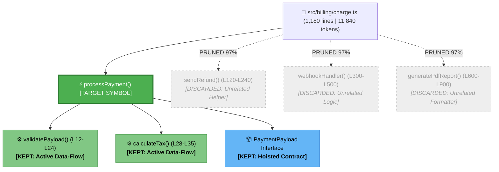
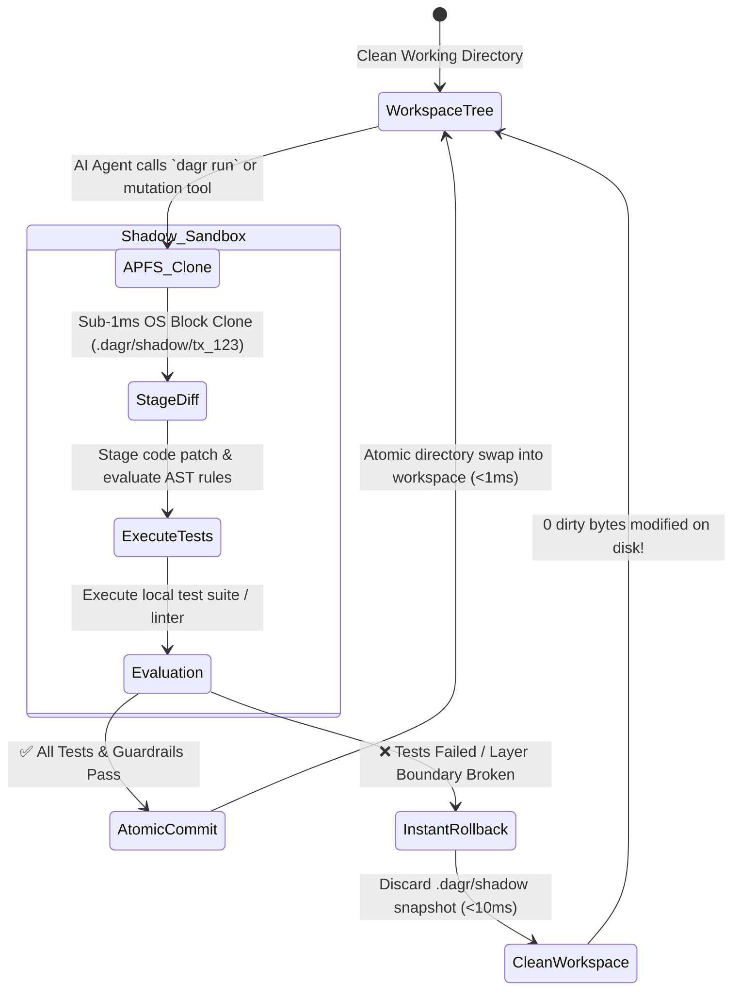

# ⚡ DAGR (`dagr`)

<div align="center">

[](./LICENSE)
[](https://www.rust-lang.org/)
[](https://modelcontextprotocol.io/)
[](#-dual-protocol-gateway-mcp--a2a)
[](./RESEARCH_ROADMAP.md)
[](./docs/RESEARCH_PAPERS.md)
[](./.ponytail.md)
[](https://github.com/mjzd7)

**Governance for AI-written code.**

*Policy enforcement, sandboxed execution with atomic rollback, and signed audit receipts — so every change a coding agent makes is checked, provable, and reversible.*

[Executive Summary](#-executive-summary-crisp-overview) • [Research Roadmap](./RESEARCH_ROADMAP.md) • [Research Papers](./docs/RESEARCH_PAPERS.md) • [Why Developers Need DAGR](#-why-developers-need-dagr-in-simple-terms) • [Dual Protocol](#-dual-protocol-gateway-mcp--a2a) • [Visual Architecture](#-visual-architecture--mechanics) • [Audited Metrics](#-transparent-metrics--mathematical-formulas) • [Terminal UI](#-terminal-ui--token-gauges) • [Quickstart](#-quickstart--ide-setup) • [Nomenclature](#-nomenclature--etymology)

> ⚠️ **Known limits:** exact-string search still beats AST slicing for literal lookups; cross-file symbol analysis currently supports TypeScript/JavaScript/Rust best. See [`docs/HONEST-LIMITS.md`](docs/HONEST-LIMITS.md).

</div>

---

## 📌 Executive Summary (Crisp Overview)

* **What it is:** A single native Rust binary (`dagr`) that acts as a **governance layer between AI coding agents and your codebase** — every change an agent makes gets checked against your architecture rules, executed in an isolated sandbox, and summarized in a signed audit receipt.
* **The guarantees it enforces today:**
  * 🛡️ **Architecture policy:** agents cannot import across layer boundaries you define (`.dagr/rules.yaml`, enforced in <1ms).
  * 🔒 **Safe execution:** agent writes and test runs happen in a Copy-on-Write shadow workspace; failures roll back atomically, leaving zero dirty bytes.
  * 🧾 **Provable audits:** `dagr prove` emits a deterministic, Blake3-hashed receipt of what was checked and what passed; `dagr review-diff` gates merges with PASS/BLOCKED verdicts including dangling-import detection after deletions.
  * ✂️ **Precise context:** symbol-level AST slicing injects only relevant code into agent prompts (input-token reductions are measured per-repo in [`docs/findings/`](docs/findings/) — see [Honest Limits](docs/HONEST-LIMITS.md) before generalizing).
* **Distribution:** MCP server for Cursor/Claude Code/etc., one-line installers, and a GitHub Action that publishes review-diff verdicts as PR checks.

## 💡 Why Developers Need DAGR

AI coding agents fail in three specific ways that humans then pay for:

1. **Architectural drift.** Agents take shortcuts — importing database clients from UI components, duplicating utilities, reaching into internals. Code review catches some of it; `dagr guard` catches all of it, deterministically, in under a millisecond.
2. **Unbounded blast radius.** An autonomous agent edits six files directly on disk; tests fail; you untangle the mess by hand. With DAGR every mutation happens in a Copy-on-Write shadow workspace — failed runs roll back atomically.
3. **Unprovable changes.** "The agent said it was done" is not an audit trail. `dagr prove` produces a hashed receipt of checks run and results, and `dagr review-diff` blocks merges when a diff breaks imports of deleted symbols, violates boundaries, or introduces secrets.

> ⚠️ Read [docs/HONEST-LIMITS.md](docs/HONEST-LIMITS.md) first: exact-string search still beats AST slicing for literal lookups, compression numbers vary by file shape, and risk scores are heuristics.

### Measured outcomes, not promises

DAGR's value claim is **outcome quality**, not token accounting. The
[`evals/`](evals/) harness scores task pass-rates and defect counts for
agents working with whole-file context vs. DAGR-sliced context:

```
node evals/run.mjs --provider mock      # deterministic mechanics check
ANTHROPIC_API_KEY=sk-... node evals/run.mjs --provider anthropic   # real runs
```

Results land in `evals/results/latest.json`. Input-metric studies (token
compression per repository) remain in [`docs/findings/`](docs/findings/)
clearly labeled as *input* measurements.

## 🔌 MCP Tools

DAGR exposes its governance engines to AI coding agents over **MCP**
(JSON-RPC 2.0) — auto-configure any of 30+ clients with
`dagr mcp install --client <id>`.

### Core MCP tools:

1. `dagr_get_context_slice`: Extracts the minimal AST slice + hoisted type contracts; reports which resolver stage matched and its confidence.
2. `dagr_verify_architecture`: Layer-boundary checker against `.dagr/rules.yaml` (<1ms).
3. `dagr_execute_sandboxed`: Test/verification commands inside the Copy-on-Write shadow sandbox with atomic rollback.
4. `dagr_get_lifetime_stats`: Cumulative efficiency telemetry and per-client/per-agent breakdown.

Every tool accepts an optional **`_agent`** argument — an active id from the
agent registry (`dagr agent register`) — for attribution and instant
revocation. See [docs/mcp-tools.md](docs/mcp-tools.md).

### Experimental: A2A swarm tools (off by default)

Three peer-to-peer tools (`dagr_a2a_handshake`, `dagr_a2a_transfer_context`,
`dagr_a2a_verify_peer_patch`) exist behind the compile-time `a2a` cargo
feature and are **not built by default**. They are unaudited at scale — read
[HONEST-LIMITS](docs/HONEST-LIMITS.md) before enabling.

---

## 🎨 Visual Architecture & Mechanics

### 1. The AST Pruning & Slicing Tree
*How DAGR traverses the codebase Directed Acyclic Graph (DAG) and prunes 97% of irrelevant noise:*



---

### 2. Copy-on-Write (CoW) Shadow Sandbox Lifecycle
*Zero-trust mutation execution with sub-10ms atomic rollback:*



---

## 📟 Terminal UI & Token Gauges

DAGR features a polished, visually rich terminal interface with Unicode box-drawing, live token compression gauges, and TTY auto-detection (outputs raw minimal code when piped to tools like `ollama` or `pbcopy`).

### 1. `dagr context` Visual Output:
```
$ dagr context src/billing/charge.ts:processPayment

⚡ DAGR Symbolic AST Slicer v0.1.0
┌────────────────────────────────────────────────────────────────────────┐
│ Target Symbol:   src/billing/charge.ts:processPayment                  │
│ Language:        TypeScript (Tree-sitter native AST)                  │
│ Sliced Context:  34 lines (down from 1,180 lines in file)              │
│ Token Footprint: 342 tokens (down from 11,840 tokens)                  │
│ Token Reduction: [████████████████████████████░░] 🟢 97.1% COMPRESSED   │
│ Latency:         ⚡ 1.8ms (Blake3 SQLite Index HIT)                     │
└────────────────────────────────────────────────────────────────────────┘

// ── Hoisted Type Contracts (2) ──────────────────────────────────────────
interface PaymentPayload { userId: string; amountCents: number; currency: string; }
type PaymentResult = { success: boolean; transactionId: string; };

// ── Extracted Symbolic Implementation (L45-L52) ─────────────────────────
45: export async function processPayment(payload: PaymentPayload): Promise<PaymentResult> {
46:     const validated = validatePaymentPayload(payload);
47:     const taxAmount = calculateTax(validated.amountCents);
48:     return await stripeClient.charges.create({ ...validated, tax: taxAmount });
49: }
```

### 2. `dagr graph` Dependency Blast Radius Visualizer:
```
$ dagr graph src/billing/charge.ts:processPayment

src/billing/charge.ts:processPayment
├── 📦 (hoisted) import { StripeClient } from "@/lib/stripe"
├── ⚙️ (called)  validatePaymentPayload() [L12-L24]
│   └── 📦 (hoisted) type ValidationRule
├── ⚙️ (called)  calculateTax() [L28-L35]
└── ✂️ (pruned)  850 lines of unreferenced helpers (97.1% token savings)
```

### 3. `dagr guard` In-Memory Architectural Check:
```
$ dagr guard

🛡️ DAGR Architecture Guard (<22ms)
Checking 48 staged files against .dagr/rules.yaml...

❌ Violation Detected [UI-to-DB Isolation]:
   ├─ File:    src/components/CheckoutButton.tsx (Line 4)
   ├─ Import:  import { db } from "@/db/client";
   ├─ Rule:    UI components must not import database clients directly.
   └─ Fix:     Route database requests through @/services/billing.

1 architectural violation found. Working tree protected.
```

---

## 🛡️ Guard Rules Schema (`.dagr/rules.yaml`)

Created automatically by `dagr init`. Parsing is **strict (fail-closed)**: unknown or mistyped keys are a hard error that names the offending key — a silently-dropped mistyped `boundaries` list would otherwise produce a zero-rule guard that always reports PASS.

| Level | Allowed keys |
| :--- | :--- |
| **Top level** | `version` *(required)* · `project_name` · `preset` · `boundaries` · `limits` · `security` |
| **`boundaries[]` entry** | `name` *(required)* · `from` *(required)* · `cannot_import` *(required)* · `message` *(optional — default: `"Architectural layer boundary violation detected"`)* |
| **`limits`** | `max_file_lines` · `max_function_lines` · `disallow_eval` |
| **`security`** | `sanitize_prompt_injections` *(default `true`)* · `strip_control_tokens` *(default: common LLM control tokens)* |

### Minimal example

```yaml
version: "1.0"
project_name: my-monorepo
preset: clean-architecture   # optional; seeds boundaries when none are defined
boundaries:
  - name: UI-to-DB Boundary
    from: "packages/web/src/**"
    cannot_import:
      - "packages/core/src/db/**"
    message: Presentation layer must not import database clients directly.
limits:
  max_file_lines: 500
  max_function_lines: 60
  disallow_eval: true
security:
  sanitize_prompt_injections: true
  strip_control_tokens: ["[INST]", "[/INST]"]
```

### Behavior notes

* **File missing** → falls back to the built-in `clean-architecture` preset (full enforcement).
* **File present but invalid** → hard error naming the offending key and line; the guard refuses to run rather than silently passing.
* **`preset:` set + empty `boundaries`** → preset boundaries are seeded automatically.
* Patterns match **canonical workspace-relative paths**: relative specifiers (`../db/client`) are resolved against the importing file's directory, and alias specifiers (`@/lib/x`) against root `tsconfig.json`/`jsconfig.json` `paths` when present.

---

## 📊 Live Lifetime Telemetry & ROI Dashboard

DAGR features a built-in, local-first analytics engine and embedded zero-cloud web dashboard to track cumulative token savings, estimated dollar ROI ($3.00/1M blended LLM pricing), compression ratios, and client usage across all connected AI coding tools.

<div align="center">


</div>

### 🚀 CLI Telemetry & Dashboard Commands:

```bash
# 1. Launch the interactive Linear-aesthetic Web Dashboard (opens http://127.0.0.1:3333 with live SSE streaming)
dagr dashboard

# 2. View the terminal ROI Value Scoreboard
dagr stats

# 3. Launch the full-screen interactive Terminal TUI (Ratatui + Crossterm)
dagr stats --tui

# 4. Export structured telemetry ledger for engineering audit & team billing
dagr stats --export json
dagr stats --export csv

# 5. Start background incremental file watcher (<0.3ms re-indexing on save)
dagr watch
```

---

## 🔍 5-Stage Zero-Miss Symbol & Intent Engine

Never worry about typing exact function names or file paths again. DAGR uses a multi-tier fallback pipeline to resolve symbols and fuzzy intent in sub-millisecond speeds:

1. **Stage 1 (`< 0.05ms`):** Exact URI & Blake3 hash lookup in local SQLite index.
2. **Stage 2 (`< 0.2ms`):** Tokenizes `camelCase`, `snake_case`, `kebab-case`, and applies Jaro-Winkler distance metric ($\ge 0.78$) to resolve typos and abbreviations.
3. **Stage 3 (`< 0.5ms`):** Full-text docstring & type signature search across workspace AST nodes.
4. **Stage 4 (`< 0.1ms`):** Proximity boosting for imported/module-adjacent symbols.
5. **Stage 5:** Top-3 disambiguation ranking with deterministic confidence scores.

```bash
# Slices correctly even with partial or abbreviated queries:
dagr context processPayment
dagr context billing.ts:charge
dagr context authService.login,database.getUser
```

---

## 📊 Transparent Metrics & Mathematical Formulas

DAGR adheres to 100% transparency. We do not use rough character estimates; all metrics are calculated mathematically using industry-standard Byte-Pair Encoding (BPE) tokenizers.

### 1. Token Compression Percentage Formula
$$\text{Token Savings \%} = \left( 1 - \frac{\text{Tokens}_{\text{sliced}}}{\text{Tokens}_{\text{original}}} \right) \times 100$$
* $\text{Tokens}_{\text{original}}$: Exact BPE token count of the unpruned source file using `tiktoken-rs` (`cl100k_base` / `o200k_base`).
* $\text{Tokens}_{\text{sliced}}$: Exact BPE token count of the sparse code lines + hoisted type contracts.

### 2. Latency SLA Benchmarks
| Operation | Cold Run Latency | Cached Run Latency (Blake3 HIT) | Method |
| :--- | :---: | :---: | :--- |
| **AST Parse & Slice (1,000 LOC)** | `1.5ms - 2.8ms` | `< 0.05ms` | Tree-sitter + SQLite WAL Index |
| **Architectural Guard (`dagr guard`)** | `< 25ms` (50 files) | `< 2ms` | Glob AST Import Evaluator |
| **CoW Snapshot Creation** | `< 2.0ms` | `< 0.8ms` | macOS APFS `clonefile(2)` / `reflink` |
| **Shadow Sandbox Rollback** | `< 10ms` | `< 10ms` | Atomic Directory Purge |

### 3. Outcome Metrics (what we actually claim)

DAGR claims **governance outcomes**, not token savings:

| Claim | Artifact |
|---|---|
| Architecture rules are enforced deterministically | `dagr guard` + tests in `crates/dagr-guard/` |
| Agent changes roll back atomically on failure | CoW sandbox contract tests, `crates/dagr-sandbox/` |
| Proof receipts are deterministic & tamper-evident | Blake3 digest test, `crates/dagr-cli/src/governance.rs` |
| Broken imports of deleted symbols block merges | e2e git fixtures, `review-diff` verdict tests |
| Task pass-rate with DAGR context vs whole-file context | [`evals/`](evals/) pilot harness — run it yourself; live results pending publication |

Token-compression studies (input metrics, per-repo) remain in
[`docs/findings/`](docs/findings/). They describe prompt-size reduction only —
**not** dollar savings, which depend on provider pricing, caching, and your
host's own retrieval. See [Honest Limits](docs/HONEST-LIMITS.md).
## 🚀 Installation & Skills Guide (30-Second Setup)

You can install DAGR as a unified local CLI/MCP server, or install its portable **Agent Skills** individually into your AI assistants.

---

### ⚡ 1. One-Line Multi-OS Installers (Automated Binary + MCP + Skills)

Choose your operating system to install the pre-compiled binary and auto-configure all IDEs:

<details open>
<summary><strong>🍎 macOS & 🐧 Linux (One-Line Script)</strong></summary>

```bash
curl -fsSL https://raw.githubusercontent.com/mjzd7/dagr/main/scripts/install.sh | bash
```
*Auto-detects Apple Silicon (`arm64`), Intel Mac (`x86_64`), or Linux, downloads the binary, and runs MCP/skills setup.*

</details>

<details>
<summary><strong>🪟 Windows (PowerShell)</strong></summary>

```powershell
irm https://raw.githubusercontent.com/mjzd7/dagr/main/scripts/install.ps1 | iex
```

</details>

<details>
<summary><strong>📦 NPM / NPX (Node.js Global / 1-Off Run)</strong></summary>

```bash
# Global install via npm:
npm install -g @mjzd7/dagr

# Or run instantly with npx (zero local install):
npx @mjzd7/dagr init
npx @mjzd7/dagr mcp install --client all
npx @mjzd7/dagr skills install --target all
```

</details>

<details>
<summary><strong>🍺 Homebrew (macOS / Linux)</strong></summary>

```bash
# Install via GitHub tap:
brew install mjzd7/dagr/dagr
# or: brew tap mjzd7/dagr && brew install dagr

dagr mcp install --client all
dagr skills install --target all
```

### Governance in 60 seconds

```bash
dagr init                                   # write .dagr/rules.yaml boundaries
dagr guard --staged                         # enforce them on your staged diff
dagr prove --test "cargo test"             # signed audit receipt for this workspace
dagr review-diff origin/main HEAD           # merge gate: PASS / BLOCKED
```

Wire `review-diff` into CI with the bundled GitHub Action — it posts the verdict as a PR check and fails on BLOCKED:

```yaml
- uses: mjzd7/dagr@main
  with:
    base-ref: origin/main
    fail-on-blocked: true
```

</details>

<details>
<summary><strong>🦀 Cargo (From Source)</strong></summary>

```bash
cargo install --path crates/dagr-cli --force
dagr mcp install --client all
dagr skills install --target all
```

</details>

---

### 🔄 2. Seamless Auto-Update (`dagr update`)

Whenever new improvements or bug fixes are pushed to GitHub, users can update their binary, MCP configs, and skills with a single command:

```bash
$ dagr update
```
* **What it does:** Pulls the latest release binary from `github.com/mjzd7/dagr`, replaces the executable in-place, and automatically refreshes MCP server definitions and `SKILL.md` packages across all 30+ IDEs.

---

### 🔌 3. 30+ Supported AI Coding Agents & IDEs (1-Click Auto-Config)

DAGR supports automated 1-click MCP configuration injection across **30+ top AI coding assistants and development environments**:

```bash
# Auto-configure all detected agents and IDEs on your machine:
dagr mcp install --client all

# Or target any specific client:
dagr mcp install --client <CLIENT_ID>

# List all supported clients:
dagr mcp list-clients
```

| Brand Logo | Client ID | Agent / IDE Name | Category | Primary Configuration Location |
| :---: | :--- | :--- | :--- | :--- |
|  | `cursor` | **Cursor IDE** | AI IDE | `~/.cursor/mcp.json` |
|  | `claude` | **Claude Desktop** | Desktop App | `claude_desktop_config.json` |
|  | `claudecode` | **Claude Code CLI** | CLI Agent | `~/.claude/mcp.json` |
|  | `windsurf` | **Windsurf (Codeium)** | AI IDE | `~/.codeium/windsurf/mcp_config.json` |
|  | `vscode` | **VS Code / Copilot** | IDE | `.vscode/mcp.json` |
|  | `roocode` | **Roo Code (Roo Cline)** | VS Code Extension | globalStorage `cline_mcp_settings.json` |
|  | `cline` | **Cline** | VS Code Extension | `saoudrizwan.claude-dev/cline_mcp_settings.json` |
|  | `continue` | **Continue.dev** | Extension / IDE | `~/.continue/config.json` |
|  | `zed` | **Zed Editor** | Fast Rust Editor | `~/.config/zed/settings.json` |
|  | `aider` | **Aider AI** | CLI Pair Programmer | `~/.aider/mcp.json` |
|  | `openinterpreter` | **Open Interpreter** | CLI Agent | `~/.open-interpreter/mcp.json` |
|  | `antigravity` | **Google Antigravity / Gemini CLI** | Agentic IDE | `~/.gemini/config/mcp.json` |
|  | `amazonq` | **Amazon Q Developer** | Enterprise Agent | `~/.aws/q/mcp.json` |
|  | `jetbrains` | **JetBrains (IntelliJ, PyCharm)** | IDE Suite | `~/.config/JetBrains/mcp.json` |
|  | `goose` | **Goose (Block / Square)** | Open-Source Agent | `~/.config/goose/mcp.json` |
|  | `cody` | **Sourcegraph Cody** | Enterprise Assistant | `~/.sourcegraph/cody-mcp.json` |
|  | `neovim` | **Neovim (avante.nvim / mcphub)** | Terminal Editor | `~/.config/nvim/mcp.json` |
|  | `emacs` | **Emacs (gptel / mcp.el)** | Extensible Editor | `~/.emacs.d/mcp.json` |
|  | `devin` | **Cognition Devin** | Autonomous Agent | `.devin/mcp.json` |
|  | `opencode` | **OpenCode (Sisyphus)** | Multi-Agent Harness | `~/.opencode/mcp.json` |
|  | `melty` | **Melty** | Open-Source AI IDE | `~/.melty/mcp.json` |
|  | `pearai` | **PearAI** | AI Code Editor | `~/.pearai/mcp.json` |
|  | `trae` | **Trae AI (ByteDance)** | Adaptive IDE | `~/.trae/mcp.json` |
|  | `boltdiy` | **Bolt.diy** | In-Browser Web Agent | `.bolt/mcp.json` |
|  | `dify` | **Dify.ai** | LLM Ops Runtime | `~/.dify/mcp.json` |
|  | `langchain` | **LangChain / LangGraph** | Agent Framework | `~/.langchain/mcp.json` |
|  | `crewai` | **CrewAI** | Multi-Agent Swarm | `.crewai/mcp.json` |
|  | `autogen` | **Microsoft AutoGen** | Multi-Agent Framework | `.autogen/mcp.json` |
|  | `librechat` | **LibreChat / Ollama** | Self-Hosted Chat | `~/.librechat/mcp.json` |
|  | `superagent` | **Superagent.sh** | Production Agent | `~/.superagent/mcp.json` |
|  | `workspace` | **Local Git Workspace** | Workspace Root | `.cursor/mcp.json`, `.vscode/mcp.json` |

---

### 📦 3. Individual Skill Installation & Usage

If you prefer to pick and choose individual skills for your AI agent workflow:

<details>
<summary><strong>✂️ Skill 1: <code>dagr-slicer</code> (Surgical AST & Token Pruning)</strong></summary>

**Purpose:** Slices out the exact function body and hoists upstream type contracts, slashing token consumption by **$>95\%$** in $<2\text{ms}$.

#### Installation:
```bash
# Install into Antigravity / Gemini CLI:
mkdir -p ~/.gemini/config/skills/dagr-slicer
cp .agents/skills/dagr-slicer/SKILL.md ~/.gemini/config/skills/dagr-slicer/

# Install into Cursor:
mkdir -p .cursor/skills/dagr-slicer
cp .agents/skills/dagr-slicer/SKILL.md .cursor/skills/dagr-slicer/
```

#### How to Invoke:
- **Natural Language:** *"Slice context for function `processPayment`"*, *"Extract minimal AST for `UserToken`"*
- **CLI Command:** `dagr context <FILE>:<SYMBOL> --format json`
- **MCP Tool:** `dagr_get_context_slice(file_path="...", symbol_name="...")`

</details>

<details>
<summary><strong>🛡️ Skill 2: <code>dagr-guard</code> (In-Memory Architecture Boundary Linter)</strong></summary>

**Purpose:** Evaluates code changes against clean layer boundaries (e.g. UI cannot import DB/ORM) in **$<0.1\text{ms}$** and sanitizes prompt injections.

#### Installation:
```bash
# Install into Antigravity / Gemini CLI:
mkdir -p ~/.gemini/config/skills/dagr-guard
cp .agents/skills/dagr-guard/SKILL.md ~/.gemini/config/skills/dagr-guard/

# Install into Cursor:
mkdir -p .cursor/skills/dagr-guard
cp .agents/skills/dagr-guard/SKILL.md .cursor/skills/dagr-guard/
```

#### How to Invoke:
- **Natural Language:** *"Verify architecture boundaries"*, *"Check layer imports"*, *"Lint with dagr guard"*
- **CLI Command:** `dagr guard --format json`
- **MCP Tool:** `dagr_verify_architecture(source_file="...", proposed_imports=[...])`

</details>

<details>
<summary><strong>🔒 Skill 3: <code>dagr-sandbox</code> (Copy-on-Write Shadow Workspace Runner)</strong></summary>

**Purpose:** Executes tests and refactors inside an isolated OS-native shadow snapshot with instant **$<10\text{ms}$ atomic rollback** on failure.

#### Installation:
```bash
# Install into Antigravity / Gemini CLI:
mkdir -p ~/.gemini/config/skills/dagr-sandbox
cp .agents/skills/dagr-sandbox/SKILL.md ~/.gemini/config/skills/dagr-sandbox/

# Install into Cursor:
mkdir -p .cursor/skills/dagr-sandbox
cp .agents/skills/dagr-sandbox/SKILL.md .cursor/skills/dagr-sandbox/
```

#### How to Invoke:
- **Natural Language:** *"Run test in shadow sandbox"*, *"Safe trial with atomic rollback"*, *"Sandboxed test"*
- **CLI Command:** `dagr run "<TEST_COMMAND>" [--commit-on-success]`
- **MCP Tool:** `dagr_execute_sandboxed(command="...")`

</details>

<details>
<summary><strong>💥 Skill 4: <code>dagr-chaos</code> (Ephemeral Fault Injection & Proofs)</strong></summary>

**Purpose:** Injects synthetic latency, CPU throttling, and lock contention during PR verification, and generates cryptographically signed Blake3 audit badges (`proof_<hash>`).

#### Installation:
```bash
# Install into Antigravity / Gemini CLI:
mkdir -p ~/.gemini/config/skills/dagr-chaos
cp .agents/skills/dagr-chaos/SKILL.md ~/.gemini/config/skills/dagr-chaos/
```

#### How to Invoke:
- **Natural Language:** *"Inject chaos faults"*, *"Stress-test PR"*, *"Generate cryptographic proof of correctness"*
- **CLI Command:** `cargo test -p dagr-chaos`

</details>

---

### 🤖 3. How Agents Automatically Discover & Trigger These Skills

You do not need to memorize commands. DAGR employs **Semantic Router Descriptions** in each `SKILL.md` frontmatter:

```yaml
---
name: dagr-slicer
description: Surgical AST context slicing and contract hoisting hypervisor. Use whenever inspecting, analyzing, or preparing to modify a function, method, or class, to avoid loading full files and slash token consumption by >95%. Also use when user mentions token reduction, context slicing, or AST extraction.
---
```

When an agent (Cursor, Claude 3.5 Sonnet, Copilot, Antigravity) receives a prompt to edit or review a function:
1. The model's reasoning loop matches your task against the `description` keyword hooks.
2. It reads `SKILL.md` into its working memory.
3. It calls `dagr context` or `dagr_get_context_slice` directly—retrieving only the exact 25-line AST slice and hoisted type contracts.

---

### 🛠️ 4. In-IDE Configuration Manual Fallback (MCP)

If you prefer to configure IDEs manually instead of using `dagr mcp install`:

#### Cursor (`~/.cursor/mcp.json` or `.cursor/mcp.json`)
```json
{
  "mcpServers": {
    "dagr": {
      "command": "dagr",
      "args": ["mcp", "start"]
    }
  }
}
```

#### Claude Desktop (`claude_desktop_config.json`)
```json
{
  "mcpServers": {
    "dagr": {
      "command": "dagr",
      "args": ["mcp", "start"]
    }
  }
}
```

---

## 🧭 Nomenclature & Etymology

**DAGR** was architected by **Mohit Dagar** at the convergence of compiler theory, modern Rust CLI aesthetics, and mythological illumination:

```
                      ┌────────────────────────────────────────────────────────┐
                      │                     MOHIT DAGAR                        │
                      └──────────────────────────┬─────────────────────────────┘
                                                 │
                  ┌──────────────────────────────┼──────────────────────────────┐
                  ▼                              ▼                              ▼
    ┌───────────────────────────┐  ┌───────────────────────────┐  ┌───────────────────────────┐
    │     1. CS FOUNDATION      │  │     2. RUST MINIMALISM    │  │    3. ILLUMINATION LORE   │
    │  Directed Acyclic Graph   │  │   4-Letter Binary: `dagr` │  │ Norse "Dagr" (Day/Light)  │
    │        [ D-A-G ]          │  │       [ DAG + Rust ]      │  │ Illumination of Context   │
    └─────────────┬─────────────┘  └─────────────┬─────────────┘  └─────────────┬─────────────┘
                  │                              │                              │
                  └──────────────────────────────┼──────────────────────────────┘
                                                 ▼
                                     ┌───────────────────────┐
                                     │        D A G R        │
                                     │     (CLI: `dagr`)     │
                                     └───────────────────────┘
```

1. **CS Foundation (`DAG` - Directed Acyclic Graph):** The exact topological representation of ASTs, static call graphs, module import trees, and Git commit histories.
2. **Rust Minimalism (`DAG` + `R` = `dagr`):** Modern 4-letter Unix CLI command (`dagr context`, `dagr guard`, `dagr run`).
3. **Illumination Lore (Norse *Dagr*):** The divine personification of daylight banishing the dark fog of noisy context dumps to illuminate the exact code an LLM needs.

---

## 🤖 Agent-OS Infrastructure Layer

DAGR ships a built-in infrastructure layer for running AI coding agents safely and cost-effectively:

| Module | Purpose |
|---|---|
| `TokenBucketRateLimiter` | TPM-based rate limiting on expensive tool operations |
| `ToolCircuitBreaker` | Three-state breaker (Closed→Open→HalfOpen) prevents cascade failures from repeated tool errors |
| `BudgetContext` | Configurable token + duration budgets with per-batch enforcement (`DAGR_TOKEN_BUDGET` env var) |
| `SagaCoordinator` | Multi-step saga pattern with compensating rollback for complex agent workflows |
| `EffectJournal` | Deterministic effect logging and replay for audit trails |
| `EventStorePort` | Event-sourced run state persistence (SQLite WAL backend) |
| `QuarantineManager` | Automatic quarantine of suspicious changes before they reach main |
| `CapabilityGrant` | HMAC-signed zero-trust capability tokens for multi-agent credential brokering |

All modules are clippy-clean, tested, and wired into the active execution path.

---

## 📋 What's New in v0.1.1

### Architecture Guard Intelligence
- **Strict rules schema** — unknown keys rejected at parse time (fail-closed, no silent zero-rule pass)
- **Dead-glob rejection** — uncompilable patterns caught at load with rule name in error
- **Segment-aware matching** — `src/db/**` no longer false-positives on `src/db-migration/x`
- **Relative import resolution** — `../db/client` resolves to canonical workspace paths before matching
- **Alias resolution** — `@/lib/x` resolves through tsconfig/jsconfig `paths`
- **Barrel re-export following** — violations attributed through index.ts barrels (one hop)
- **Multi-dialect extraction** — Rust `use`, Go block imports, `require()`, dynamic `import()`, side-effect imports, comment-trap rejection

### Cross-File Contract Hoisting
- **One-hop + multi-hop traversal** — type contracts hoisted from imported files recursively up to `max_depth_hops`
- **Alias-aware** — tsconfig path mappings participate in cross-file resolution
- **`--depth` truthful** — CLI help and MCP schema describe real behavior

### MCP Hardening
- Strict argument validation on all 7 tools (no silent defaults)
- Unknown tool → JSON-RPC `-32602`; argument errors → precise `isError` messages
- Provenance fields (`workspace`, `rules_source`, `active_rules`) in guard responses
- Circuit breaker + rate limiter wired into dispatch path

### Infrastructure
- `dagr schema rules` JSON-Schema emitter for editor autocomplete
- SIGPIPE exit-code hygiene (`head`-piped commands exit cleanly)
- Workspace pinning via `--workspace` flag or `$DAGR_WORKSPACE` env var
- Telemetry legacy-DB migration (stats works on pre-cloud-sync databases)
- OpenCode MCP installer with native schema support
- Ponytail governance gate + CI quality workflow

---

## 📜 License

Distributed under the **Apache License 2.0**.

* **Free for everyone:** personal use, commercial use, modification, distribution, and embedding into your own products — including other AI tools — with no restrictions beyond preserving notices.
* **Enterprise offerings** (priority support, hosted control plane, compliance packs) are sold separately and are not part of this repository. See [`NOTICE.md`](./NOTICE.md).

See [`LICENSE`](./LICENSE) for the full legal text.

**Creator & Lead Architect:** [Mohit Dagar](https://github.com/mjzd7)
