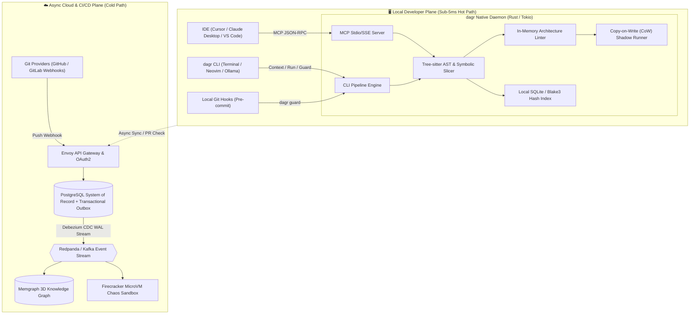

# ⚡ DAGR (`dagr`)

<div align="center">

[](https://opensource.org/licenses/MIT)
[](https://www.rust-lang.org/)
[](https://modelcontextprotocol.io/)
[](./.ponytail.md)

**The DAG-Native Symbolic AST Slicing Hypervisor & Safety Sandbox for AI Coding Agents.**

*Sub-5ms context pruning, 95% token compression, and zero-trust Copy-on-Write (CoW) sandboxing for Cursor, Claude Desktop, Ollama, and Neovim.*

[Features](#-features) • [Architecture](#-architecture) • [Etymology](#-nomenclature--etymology) • [Quickstart](#-quickstart) • [Roadmap](#-phased-roadmap)

</div>

---

## 🎯 What is DAGR?

Autonomous AI coding agents frequently suffer from two fatal failure modes:
1. **Context Explosion (95% Token Bloat):** Passing giant files or noisy top-K vector search dumps to LLMs, inflating token bills and degrading reasoning quality.
2. **Architectural Drift & Unbounded Blast Radius:** Agents generating duplicate helpers, violating SOLID/layer boundaries, and committing destructive mutations to working trees.

**DAGR** is an ultra-fast, local-first safety hypervisor and symbolic AST slicer written in pure Rust. It intercepts agent actions and extracts the **exact minimal slice of code and type contracts** needed, executing all mutations in isolated Copy-on-Write (CoW) shadow sandboxes with 10ms rollbacks.

---

## ⚡ Key Features

* ✂️ **Symbolic AST Slicing (95% Token Reduction):** Replaces unstructured vector chunks with backwards data-flow slicing over Abstract Syntax Trees (ASTs). Extract the exact ~35 lines needed.
* 🛡️ **Copy-on-Write (CoW) Shadow Sandboxing:** Executes agent writes and tests inside an OS-native shadow snapshot (`clonefile(2)` on macOS, `reflink` on Linux) with sub-10ms atomic rollback on failure.
* 🔌 **Model Context Protocol (MCP) Gateway:** Native JSON-RPC 2.0 stdio/SSE server exposing `get_context_slice`, `verify_architecture`, and `execute_sandboxed` to Cursor, Windsurf, and Claude.
* ⚡ **Ultra-Fast Local Daemon (<5ms):** Compiled native Rust binary with embedded Tree-sitter parsers (TypeScript, Python, Go, Rust) and Blake3 hash caching. Zero Docker or cloud dependencies required for local use.
* 📏 **Architectural Guardrails (`dagr guard`):** In-memory linter validating layer import boundaries (e.g. UI cannot import database clients directly) and stripping indirect prompt injections.

---

## 🧭 Nomenclature & Etymology

**DAGR** was architected by **Mohit Dagar** at the intersection of compiler theory, modern Rust CLI aesthetics, and mythological illumination:

```
                      ┌────────────────────────────────────────────────────────┐
                      │                     MOHIT DAGAR                        │
                      └──────────────────────────┬─────────────────────────────┘
                                                 │
                  ┌──────────────────────────────┼──────────────────────────────┐
                  ▼                              ▼                              ▼
    ┌───────────────────────────┐  ┌───────────────────────────┐  ┌───────────────────────────┐
    │     1. CS FOUNDATION      │  │     2. RUST MINIMALISM    │  │    3. ILLUMINATION LORE   │
    │  Directed Acyclic Graph   │  │   4-Letter Binary: `dagr` │  │ Norse "Dagr" (Day/Light)  │
    │        [ D-A-G ]          │  │       [ DAG + Rust ]      │  │ Illumination of Context   │
    └─────────────┬─────────────┘  └─────────────┬─────────────┘  └─────────────┬─────────────┘
                  │                              │                              │
                  └──────────────────────────────┼──────────────────────────────┘
                                                 ▼
                                     ┌───────────────────────┐
                                     │        D A G R        │
                                     │     (CLI: `dagr`)     │
                                     └───────────────────────┘
```

1. **Computer Science Foundation (`DAG` - Directed Acyclic Graph):** The core mathematical representation of ASTs, static call graphs, module import trees, and Git histories.
2. **Rust CLI Minimalism (`DAG` + `R` = `dagr`):** Clean 4-letter Unix command (`dagr context`, `dagr guard`, `dagr run`).
3. **Illumination Lore (Norse *Dagr*):** The divine personification of daylight banishing the dark fog of noisy context dumps to illuminate the exact code an LLM needs.

---

## 📐 Dual-Plane Architecture



---

## 🚀 Quickstart

### Installation
```bash
# Clone the repository
git clone https://github.com/mjzd7/dagr.git
cd dagr

# Build with Cargo
cargo build --release
```

### Basic Commands
```bash
# Extract minimal backwards AST slice for a symbol
dagr context src/billing/charge.ts:processPayment

# Run architectural boundary linter (<35ms Git pre-commit check)
dagr guard

# Execute a tool mutation inside a Copy-on-Write shadow sandbox with auto-rollback
dagr run "npm test" --sandbox

# Start the Model Context Protocol (MCP) server for Cursor / Claude Desktop
dagr mcp start
```

---

## 📅 Phased Roadmap

* **Phase 1 (Community / Local Powerhouse):** Pure Rust native binary, Tree-sitter AST Slicer (TS/Python/Go/Rust), APFS/reflink CoW sandbox, MCP stdio server.
* **Phase 2 (Developer Workflows & Plugins):** IDE extensions for Cursor, VS Code, and Neovim; interactive TUI visualizer.
* **Phase 3 (Enterprise & Cloud Teams):** Multi-repo 3D knowledge graph (Memgraph), distributed Kafka CDC outbox, ephemeral MicroVM chaos testing in CI/CD.

---

## 📜 License

Distributed under the **MIT License**. See [`LICENSE`](./LICENSE) for details.

**Lead Architect & Creator:** [Mohit Dagar](https://github.com/mjzd7)
