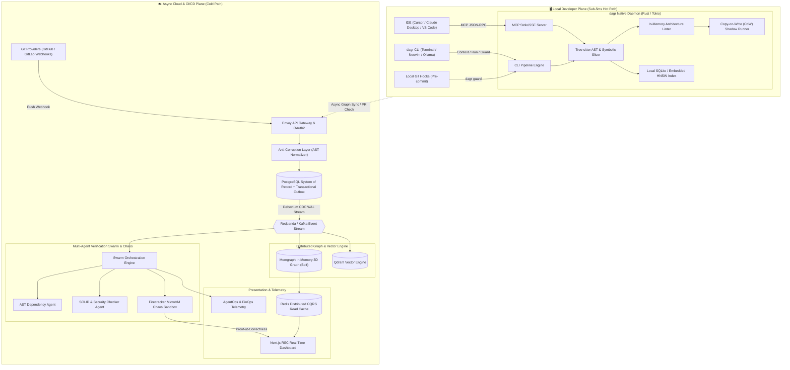
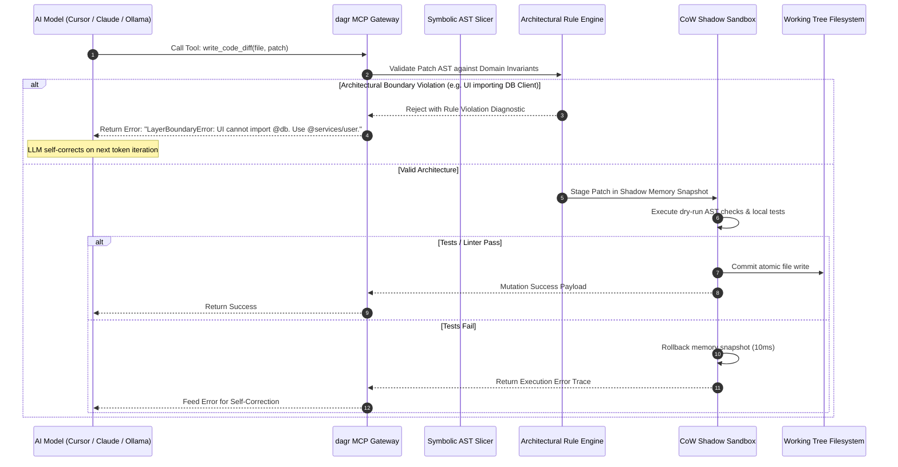
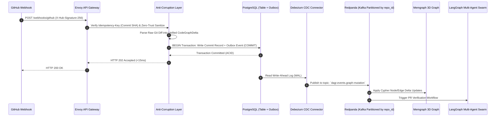
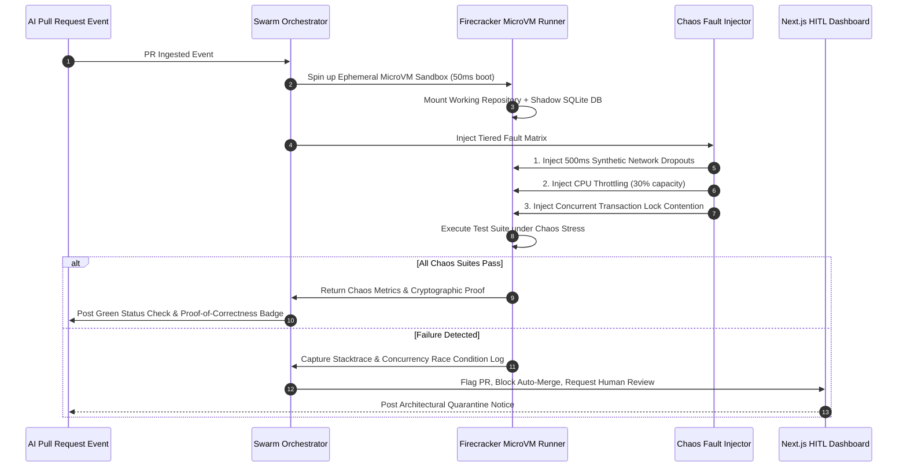
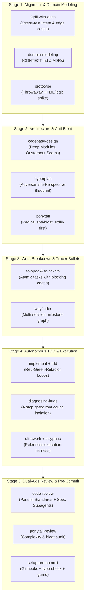

# ⚡ DAGR: Master Architectural Specification & Implementation Plan

> **Creator & Lead Architect:** Mohit Dagar  
> **Repository & Binary:** `dagr` (Crates.io: `dagr` / `dagr-cli`)  
> **Tagline:** The DAG-Native Symbolic AST Slicing Hypervisor & Safety Sandbox for AI Coding Agents.

---

## 🧭 Nomenclature, Etymology & Brand Philosophy

The name **DAGR** (`dagr`) was conceived and architected by **Mohit Dagar** at the convergence of compiler theory, modern Rust CLI aesthetics, and mythological illumination:

```
                      ┌────────────────────────────────────────────────────────┐
                      │                     MOHIT DAGAR                        │
                      └──────────────────────────┬─────────────────────────────┘
                                                 │
                  ┌──────────────────────────────┼──────────────────────────────┐
                  ▼                              ▼                              ▼
    ┌───────────────────────────┐  ┌───────────────────────────┐  ┌───────────────────────────┐
    │     1. CS FOUNDATION      │  │     2. RUST MINIMALISM    │  │    3. ILLUMINATION LORE   │
    │  Directed Acyclic Graph   │  │   4-Letter Binary: `dagr` │  │ Norse "Dagr" (Day/Light)  │
    │        [ D-A-G ]          │  │       [ DAG + Rust ]      │  │ Illumination of Context   │
    └─────────────┬─────────────┘  └─────────────┬─────────────┘  └─────────────┬─────────────┘
                  │                              │                              │
                  └──────────────────────────────┼──────────────────────────────┘
                                                 ▼
                                     ┌───────────────────────┐
                                     │        D A G R        │
                                     │     (CLI: `dagr`)     │
                                     └───────────────────────┘
```

1. **The Computer Science Foundation (`DAG` - Directed Acyclic Graph):**
   * Abstract Syntax Trees (ASTs), static call graphs, module import hierarchies, and Git commit trees are all **Directed Acyclic Graphs (DAGs)**.
   * `dagr` natively parses, indexes, and slices codebase DAGs with deterministic mathematical precision.

2. **The Modern Rust CLI Aesthetic (`DAG` + `R` = `dagr`):**
   * Built in the spirit of ultra-fast modern Unix/Rust tools (`fzf`, `tmux`, `zoxide`, `ripgrep`), `dagr` is a compact, memorable 4-letter binary that feels native to any terminal workflow.

3. **The Illumination Lore (Norse *Dagr* - God of Daylight & Radiance):**
   * In Norse mythology, **Dagr** is the divine personification of daylight who rides across the sky bringing radiant light and banishing darkness.
   * In modern AI engineering, `dagr` banishes the "dark fog" of noisy context dumps and token bloat—illuminating the exact, crystal-clear ~35 lines of code an LLM needs to produce flawless code.

---

## 🎯 Executive Summary & System Vision

**Dagr** is an autonomous, event-driven developer infrastructure platform and local-first safety hypervisor designed to eliminate the two critical failure modes of modern AI-assisted software engineering:
1. **Context Explosion & Token Bloat:** AI tools choking on noisy top-K vector dumps and massive files, inflating token bills and degrading reasoning quality.
2. **Architectural Drift & Unbounded Blast Radius:** Autonomous AI agents generating duplicate utilities, violating SOLID and layer boundaries, and executing unsafe mutations across multi-service codebases.

Dagr delivers a **Dual-Plane Architecture**:
* **Local Hot Plane (`dagr` CLI / Daemon):** A single, ultra-fast native Rust binary embedded with Tree-sitter AST parsers, symbolic program slicing, and Copy-on-Write (CoW) shadow transaction sandboxes. It delivers sub-5ms in-IDE tool interception via the **Model Context Protocol (MCP)** and a dedicated **CLI command surface** (`dagr context`, `dagr run`, `dagr guard`) to supercharge local/smaller models (Llama 3 8B, Qwen 2.5 Coder, Ollama) and terminal workflows.
* **Async Cold Plane (Cloud / CI/CD):** An enterprise-grade event-driven pipeline powered by **PostgreSQL + Redpanda/Kafka + Memgraph + MicroVM Chaos Sandboxes** for multi-repo 3D knowledge graph indexing and automated PR proof-of-correctness verification.

---

## 📐 System Architecture & High-Level Diagrams (HLD)

### 1. Dual-Plane System Topology



---

## 🔄 End-to-End Data Flow Diagrams (DFD)

### Flow 1: Real-Time MCP Tool Call Interception & Symbolic Slicing (Local Path)



---

### Flow 2: Git Push Ingestion, CDC Outbox, & Event Sourcing (Cloud Path)



---

### Flow 3: Ephemeral Chaos Sandbox & Proof-of-Correctness Workflow



---

## 💻 Low-Level Design (LLD): Classes, Interfaces & Design Patterns

### 1. Anti-Corruption Layer (ACL) & Unified Node Model

```rust
// Unified Internal Domain Model for Codebase Entities in DAG
pub enum NodeType {
    Module,
    Class,
    Function,
    DatabaseTable,
    ApiEndpoint,
    TypeInterface,
}

pub struct CodeGraphNode {
    pub id: String,                 // Canonical URI: "repo://src/auth/jwt.ts#verifyToken"
    pub organization_id: String,
    pub repository_id: String,
    pub node_type: NodeType,
    pub symbol_name: String,
    pub file_path: String,
    pub line_range: (u32, u32),
    pub docstring_sanitized: String,// Zero-trust sanitized text
    pub content_hash: String,
}

pub enum EdgeType {
    Calls,
    Imports,
    Inherits,
    MutatesSchema,
    ExposesRoute,
}

pub struct CodeGraphEdge {
    pub source_id: String,
    pub target_id: String,
    pub edge_type: EdgeType,
    pub weight: f32,
}

// Factory Pattern for Multi-Language AST Parsing
pub trait AstParserStrategy: Send + Sync {
    fn parse_file(&self, file_path: &str, content: &str) -> Result<Vec<CodeGraphNode>, AstError>;
    fn extract_edges(&self, nodes: &[CodeGraphNode], content: &str) -> Vec<CodeGraphEdge>;
}

pub struct AstParserFactory;
impl AstParserFactory {
    pub fn get_parser(language: &str) -> Box<dyn AstParserStrategy> {
        match language {
            "typescript" | "javascript" => Box::new(TypeScriptTreeSitterParser::new()),
            "python" => Box::new(PythonTreeSitterParser::new()),
            "go" => Box::new(GoTreeSitterParser::new()),
            "rust" => Box::new(RustTreeSitterParser::new()),
            _ => Box::new(FallbackGenericParser::new()),
        }
    }
}
```

---

### 2. Strategy Pattern for LLM Providers with Circuit Breaker

```rust
pub trait LlmProviderStrategy: Send + Sync {
    async fn generate_completion(&self, prompt: &str, system_prompt: &str) -> Result<String, LlmError>;
}

pub struct CircuitBreaker<T: LlmProviderStrategy> {
    inner: T,
    failure_count: std::sync::atomic::AtomicU32,
    state: std::sync::atomic::AtomicU8, // 0: Closed, 1: Open, 2: Half-Open
    last_failure_timestamp: std::sync::atomic::AtomicU64,
}

impl<T: LlmProviderStrategy> CircuitBreaker<T> {
    pub async fn execute(&self, prompt: &str, system_prompt: &str) -> Result<String, LlmError> {
        if self.is_open() {
            return Err(LlmError::CircuitTripped("LLM API downstream outage. Circuit OPEN."));
        }
        match self.inner.generate_completion(prompt, system_prompt).await {
            Ok(res) => {
                self.record_success();
                Ok(res)
            }
            Err(e) => {
                self.record_failure();
                Err(e)
            }
        }
    }
}
```

---

### 3. Symbolic Program Slicer (Backwards Data-Flow & Dependency Slicing)

```rust
pub struct ProgramSlicer {
    ast_index: Arc<TreeSitterAstIndex>,
}

impl ProgramSlicer {
    pub fn compute_backward_slice(
        &self,
        file_path: &str,
        target_symbol: &str,
        max_hops: u8
    ) -> Result<MinimalContextSlice, SliceError> {
        // 1. Resolve Target Node in AST DAG
        let seed_node = self.ast_index.resolve_symbol(file_path, target_symbol)?;
        
        // 2. Perform Breadth-First Data-Flow Traversal across the DAG
        let mut visited_lines = std::collections::HashSet::new();
        let mut relevant_contracts = Vec::new();
        
        self.traverse_data_flow(&seed_node, max_hops, &mut visited_lines, &mut relevant_contracts)?;
        
        // 3. Assemble Minimal Token Output Block
        Ok(MinimalContextSlice {
            target_symbol: target_symbol.to_string(),
            extracted_lines: self.ast_index.render_sparse_lines(file_path, &visited_lines),
            contracts: relevant_contracts,
            token_count: self.estimate_tokens(&visited_lines),
        })
    }
}
```

---

## 🗄️ Database & Event Schemas

### 1. PostgreSQL Relational & Transactional Outbox DDL

```sql
-- Repositories Sharded by Organization
CREATE TABLE organizations (
    id UUID PRIMARY KEY DEFAULT gen_random_uuid(),
    name VARCHAR(255) NOT NULL,
    created_at TIMESTAMP WITH TIME ZONE DEFAULT NOW()
);

CREATE TABLE repositories (
    id UUID PRIMARY KEY DEFAULT gen_random_uuid(),
    organization_id UUID NOT NULL REFERENCES organizations(id),
    repo_slug VARCHAR(255) NOT NULL, -- e.g. "org/core-backend"
    default_branch VARCHAR(64) DEFAULT 'main',
    is_active BOOLEAN DEFAULT TRUE,
    created_at TIMESTAMP WITH TIME ZONE DEFAULT NOW()
);

-- Transactional Outbox Table for Guaranteed Event Sourcing
CREATE TABLE outbox_events (
    id UUID PRIMARY KEY DEFAULT gen_random_uuid(),
    organization_id UUID NOT NULL,
    repository_id UUID NOT NULL REFERENCES repositories(id),
    event_type VARCHAR(128) NOT NULL, -- 'CommitIngested', 'ViolationDetected', 'ProofGenerated'
    aggregate_id VARCHAR(255) NOT NULL, -- commit_sha or pr_id
    payload JSONB NOT NULL,
    idempotency_key VARCHAR(255) UNIQUE NOT NULL,
    status VARCHAR(32) DEFAULT 'PENDING', -- 'PENDING', 'PROCESSED', 'FAILED'
    retry_count INT DEFAULT 0,
    created_at TIMESTAMP WITH TIME ZONE DEFAULT NOW(),
    processed_at TIMESTAMP WITH TIME ZONE
);

CREATE INDEX idx_outbox_unprocessed ON outbox_events(status, created_at) WHERE status = 'PENDING';
CREATE INDEX idx_outbox_repo_agg ON outbox_events(repository_id, aggregate_id);
```

---

### 2. Memgraph Knowledge Graph Schema (Cypher)

```cypher
// Node Constraints & Indexes for DAG Graph Traversal
CREATE CONSTRAINT ON (s:Symbol) ASSERT s.id IS UNIQUE;
CREATE CONSTRAINT ON (f:File) ASSERT f.id IS UNIQUE;
CREATE CONSTRAINT ON (t:DbTable) ASSERT t.id IS UNIQUE;

// Relationship Schema Definitions
// (:Symbol)-[:CALLS {call_count: Int, is_async: Boolean}]->(:Symbol)
// (:Symbol)-[:MUTATES_SCHEMA {operation: 'SELECT'|'INSERT'|'UPDATE'|'DELETE'}]->(:DbTable)
// (:File)-[:IMPORTS {alias: String}]->(:File)
// (:Symbol)-[:DECLARED_IN]->(:File)

// Sub-Graph Minimal Extraction Query for AST Slicing (2-Hop Blast Radius)
MATCH (seed:Symbol {id: $seed_symbol_id})
CALL apoc.path.subgraphAll(seed, {
    maxLevel: 2,
    relationshipFilter: "CALLS>|MUTATES_SCHEMA>|IMPORTS>"
})
YIELD nodes, relationships
RETURN nodes, relationships;
```

---

## 📋 Comprehensive 30 Buzzword / Principle Implementation Matrix

| # | Buzzword / Principle | Exact Concrete Implementation in Dagr |
| :--- | :--- | :--- |
| **1** | **Agentic AI** | Autonomous self-correction loop in `dagr run` and multi-agent PR review swarms that auto-generate architectural refactoring patches without human prompting. |
| **2** | **Model Context Protocol (MCP)** | Native JSON-RPC 2.0 stdio/SSE server exposing `get_symbol_slice`, `verify_architecture`, and `execute_sandboxed_tool` to Cursor, Windsurf, and Claude. |
| **3** | **Multi-Agent Orchestration** | LangGraph swarm coordinating specialized agents: AST Dependency Agent, SOLID Verifier Agent, and Chaos Runner Agent. |
| **4** | **Agentic RAG & GraphRAG** | In-memory Memgraph 3D graph traversal combined with embedded HNSW vector similarity for structural context retrieval. |
| **5** | **Human-in-the-Loop (HITL)** | Next.js RSC web dashboard that intercepts breaking architectural changes and PR chaos failures, requiring team lead sign-off. |
| **6** | **Agentic Engineering** | Replaces unstructured prompt engineering with deterministic AST slicing, type-contract generation, and automated test loops. |
| **7** | **Context Engineering** | Symbolic program slicing algorithms that extract the exact minimal ~35 lines of relevant code, reducing token payloads by 95%. |
| **8** | **React Server Components (RSC)** | Next.js server-rendered dashboard that streams live 3D dependency graph updates and context metrics without client-side bundle bloat. |
| **9** | **Serverless Edge Computing** | Edge webhook handlers running on Cloudflare Workers / Vercel Edge for sub-10ms signature verification and idempotency filtering. |
| **10** | **AgentOps & AI Evals** | Langfuse telemetry integration measuring token savings (FinOps), graph traversal latencies, and LLM code accuracy scores. |
| **11** | **Event-Driven Architecture (EDA)** | Redpanda/Kafka event bus streaming `GitPushIngested`, `GraphMutated`, and `ProofGenerated` events asynchronously. |
| **12** | **CQRS** | Segregates write-heavy graph ingestion (via Kafka into Memgraph) from ultra-fast read models (pre-aggregated Redis/Postgres materialized views). |
| **13** | **Modular Monolith** | Clean Rust workspace boundaries (`crates/daemon`, `crates/slicer`, `crates/mcp`, `crates/guard`, `crates/sandbox`) for unified builds. |
| **14** | **Database Sharding** | PostgreSQL tables and Kafka partitions sharded by `organization_id` and `repository_id` for horizontal scaling. |
| **15** | **Circuit Breaker Pattern** | State-machine wrappers isolating external LLM API provider calls (OpenAI, Claude) to prevent thread hangs during upstream outages. |
| **16** | **SOLID Principles** | Strict adherence to Single Responsibility, Open-Closed, and Dependency Inversion across all AST parser traits and tool middlewares. |
| **17** | **Factory & Strategy Patterns** | Strategy Pattern for dynamic LLM switching; Factory Pattern for multi-language Tree-sitter AST parsers. |
| **18** | **Anti-Corruption Layer (ACL)** | Normalizes diverse language ASTs (TypeScript, Python, Go, Rust) into a unified internal `CodeGraphNode` domain model. |
| **19** | **Transactional Outbox Pattern** | Guarantees atomic database writes and zero-loss event publishing to Kafka using PostgreSQL WAL CDC (Debezium). |
| **20** | **Schema Migrations & ORM** | Prisma / Drizzle ORM managing relational database entities with strict version-controlled SQL migration scripts. |
| **21** | **CAP Theorem & Eventual Consistency** | Solves the read-replica lag vs instant git push trade-off using commit-epoch version fencing and eventual consistency. |
| **22** | **Zero-Trust & Prompt Injection Defense** | Sanitizes user comments, docstrings, and commit messages to prevent indirect prompt injection attacks against downstream context agents. |
| **23** | **Idempotency** | Webhook deduplication using SHA-256 commit hash keys to prevent duplicate graph mutations on retries. |
| **24** | **API Gateway & Service Mesh** | Envoy API Gateway enforcing OAuth2/JWT authentication, rate limiting, and mTLS communication across microservices. |
| **25** | **Distributed Caching** | Redis cache-aside layer holding hot sub-graph slices, active developer session tokens, and cached AST contracts. |
| **26** | **Agentic AI Engineer** | Implements the autonomous agent reflection loops, AST tool definitions, and self-healing code repair cycles. |
| **27** | **Full-Stack AI Engineer** | Builds the Next.js RSC 3D visualizer, interactive blast radius graphs, and streaming UI components. |
| **28** | **AI Agent Architect** | Designs the event-driven Kafka stream topology, Memgraph graph schema, and zero-trust safety hypervisors. |
| **29** | **Context Engineer** | Formulates symbolic data-flow slicing algorithms to maximize code generation accuracy while minimizing token footprint. |
| **30** | **AI Integration Specialist** | Develops the universal `dagr` CLI and MCP stdio/SSE server connecting seamlessly to Cursor, Neovim, VS Code, and Ollama. |

---

## 📅 Phased Execution Roadmap

### Phase 1: Local Rust Core Engine & CLI (`crates/slicer`, `crates/cli`)
* Implement Tree-sitter AST parsers for TypeScript, Python, and Go.
* Implement the **Symbolic Program Slicer** (backwards data-flow slice extractor).
* Build the `dagr` CLI with `context`, `guard`, and `run` commands.
* Implement in-memory SQLite + embedded HNSW vector cache.

### Phase 2: Zero-Trust MCP Gateway & CoW Sandbox (`crates/mcp`, `crates/sandbox`)
* Build JSON-RPC 2.0 MCP server (`dagr mcp start`).
* Implement Copy-on-Write (CoW) shadow filesystem sandbox with 10ms rollback.
* Implement Layer Boundary and SOLID architectural rule checkers.
* Connect MCP server to Cursor, Windsurf, and Claude Desktop.

### Phase 3: Cloud Event Pipeline & 3D Knowledge Graph
* Set up Dockerized Redpanda, PostgreSQL (Transactional Outbox), and Memgraph.
* Implement Edge Webhook Gateway with Idempotency Key deduplication.
* Build Debezium CDC WAL streamer and Cypher graph mutation consumer.

### Phase 4: Ephemeral Chaos Sandbox & Proof-of-Correctness Swarm
* Implement Firecracker MicroVM / Wasm runner for PR sandboxing.
* Build Chaos Fault Injector (network dropouts, CPU throttling, concurrency locks).
* Implement Cryptographic Proof-of-Correctness report generator.

### Phase 5: Next.js RSC Dashboard & AgentOps Telemetry
* Build Next.js React Server Components dashboard with streaming 3D dependency graphs.
* Implement Human-in-the-Loop (HITL) approval modals for quarantined PRs.
* Connect Langfuse for token FinOps tracking and latency observability.

---

## 🛠️ Autonomous Agent Engineering Lifecycle (Matt Pocock Skills Integration)

To eliminate "vibe coding", hallucinated architectures, software entropy, and unverified regressions, DAGR embeds and mandates the **Matt Pocock Engineering Skills Suite** as the autonomous execution protocol across all engineering agents:



### 1. The 5-Stage Autonomous Development Lifecycle

| Stage | Trigger / Skill | Autonomous Agent Responsibility | Enforced Quality Gate |
| :--- | :--- | :--- | :--- |
| **1. Alignment & Ubiquitous Language** | `/grill-with-docs`<br/>`domain-modeling`<br/>`prototype` | • Agent interviews user/spec relentlessly to resolve ambiguity.<br/>• Updates `CONTEXT.md` (domain glossary) and creates ADRs.<br/>• Builds throwaway prototypes to validate state/interface models. | No code written without defined domain terms and resolved design tree. |
| **2. Deep Module Architecture** | `codebase-design`<br/>`hyperplan`<br/>`ponytail` | • Designs deep interfaces hiding internal complexity (Ousterhout).<br/>• Runs adversarial multi-perspective hyperplan (Security, Perf, Reliability).<br/>• Rejects bloat/unneeded dependencies (YAGNI standard library first). | Interface is narrow, implementation is deep, zero leaky abstractions. |
| **3. Work Decomposition** | `to-spec`<br/>`to-tickets`<br/>`wayfinder` | • Converts specs into tracer-bullet tickets declaring blocking edges.<br/>• Sequences parallel vs sequential subagent milestones. | Every task is atomic, testable, and has clear acceptance criteria. |
| **4. Autonomous TDD & Healing** | `implement`<br/>`tdd`<br/>`diagnosing-bugs`<br/>`ultrawork` | • **Red Phase**: Write failing integration/unit test first.<br/>• **Green Phase**: Implement minimal code to pass.<br/>• **Refactor**: Clean up while green.<br/>• **Diagnosis Loop**: Reproduce -> Locate -> Explain -> Verify before fixing bugs. | 100% test pass rate in CoW sandbox; zero unchecked mutations. |
| **5. Dual-Axis Review & Verification** | `code-review`<br/>`ponytail-review`<br/>`setup-pre-commit` | • Subagent A audits **Standards Axis** (Rust idioms, clean architecture).<br/>• Subagent B audits **Spec Axis** (faithfulness to ticket, no drift).<br/>• `ponytail-review` strips speculative dead code and over-engineering. | Clean 2-axis signoff + pre-commit hooks + `dagr guard` passing. |

---

## 🧪 Verification & Validation Strategy

1. **Local CLI Verification:** Run `dagr context src/billing.ts:charge --for "add tax"` and assert the output token count is <500 tokens (compared to 12,000 tokens for the full file tree).
2. **MCP Tool Guardrail Test:** Configure Cursor to use `dagr mcp start`. Prompt the AI to import `@db/prisma` in a UI component. Verify that the MCP server intercepts the call and rejects it with `LayerBoundaryError`.
3. **CoW Rollback Test:** Run `dagr run "destructive script that fails tests" --sandbox`. Verify that the working tree remains 100% clean with zero side effects.
4. **Chaos Resilience Test:** Submit an AI PR modifying concurrent cache logic. Verify that the MicroVM chaos harness detects race conditions under packet drops and flags the PR on the HITL dashboard.
