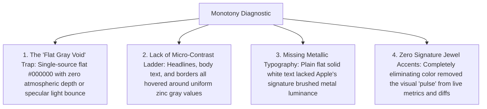

# 🎨 DAGR UI/UX Architecture & Luxury Design Roadmap

**Apple Pro Aesthetic, Neo-Swiss Typography & Luxury Developer Experience Overhaul**  
*Version 1.0.0 • Maintained by DAGR Core Product & Design Team*

---

## 🔍 1. Self-Audit Diagnostic: Why Did the Previous Version Feel Monotonous?

A critical post-mortem of the initial monochrome implementation identified 4 core visual flaws:



---

## 🏛️ 2. The 5 Pillars of the Apple Pro Luxury Overhaul

```mermaid
mindmap
  root((Apple Pro Luxury Design))
    1. Atmospheric Multi-Source Lighting
      Deep Space Obsidian Canvas (#000000 / #05060A)
      Top Specular White Spotlight (ambient bounce)
      Subtle Deep Jewel Underglow (warmth & depth)
    2. Machined Specular Glass
      Deep Titanium Frosted Glass (rgba(18, 18, 22, 0.85))
      1px Specular Top Bevel (inset 0 1px 0 0 rgba(255,255,255,0.18))
      Multi-tier elevation drop-shadows (0 12px 40px rgba(0,0,0,0.8))
    3. Neo-Swiss Typography (Stack 1: Geist)
      Display: Geist Variable (800/700 with -0.035em tight tracking)
      Code/Telemetry: Geist Mono (Tabular numerals, optical grid alignment)
      Metallic Gradient Text Fill (linear-gradient 180deg)
    4. Micro-Contrast Ladder
      Level 1: Pure Specular White (#FFFFFF) - Headlines & Focal Marks
      Level 2: Liquid Platinum (#E4E4E7) - Secondary Headings & Values
      Level 3: Brushed Titanium (#A1A1AA) - Descriptions & Explanations
      Level 4: Dark Slate (#71717A) - Metadata & Comments
    5. Kinetic Apple Springs
      Spring Curves: cubic-bezier(0.16, 1, 0.3, 1)
      Tactile Micro-Press: transform scale(0.98) on active buttons
```

---

## 🔤 3. Typography Standards (Stack 1: Geist & Geist Mono)

```html
<!-- Official Google Fonts CDN Integration -->
<link rel="preconnect" href="https://fonts.googleapis.com">
<link rel="preconnect" href="https://fonts.gstatic.com" crossorigin>
<link href="https://fonts.googleapis.com/css2?family=Geist:wght@300;400;500;600;700;800&family=Geist+Mono:wght@400;500;600;700&display=swap" rel="stylesheet">
```

### Typographic Matrix

| Element | Font Family | Weight | Tracking | Line Height | Visual Treatment |
| :--- | :--- | :--- | :--- | :--- | :--- |
| **Hero Title** | `Geist` | `800 Bold` | `-0.035em` | `1.08` | `linear-gradient(180deg, #FFF 25%, rgba(255,255,255,0.60) 100%)` |
| **Section Headings**| `Geist` | `700 Bold` | `-0.025em` | `1.20` | `linear-gradient(180deg, #FFF 40%, #A1A1AA 100%)` |
| **Feature Titles** | `Geist` | `600 Semibold` | `-0.015em` | `1.30` | `#FFFFFF` with specular sharpness |
| **Body Explanations**| `Geist` | `400 Regular` | `0` | `1.60` | `#A1A1AA` (Brushed Titanium) |
| **Code & Metrics** | `Geist Mono` | `500 Medium` | `+0.01em` | `1.45` | Tabular Numerals (`font-feature-settings: 'tnum' 1`) |

---

## 🎨 4. Surface Material & Component Recipes

### The Machined Titanium Glass Recipe
```css
.titanium-glass {
    background: rgba(18, 18, 22, 0.85);
    backdrop-filter: blur(28px) saturate(190%);
    -webkit-backdrop-filter: blur(28px) saturate(190%);
    border: 1px solid rgba(255, 255, 255, 0.10);
    border-top: 1px solid rgba(255, 255, 255, 0.20);
    box-shadow: 
        0 12px 40px -4px rgba(0, 0, 0, 0.85),
        inset 0 1px 0 0 rgba(255, 255, 255, 0.18);
    border-radius: 24px;
    transition: all 0.24s cubic-bezier(0.16, 1, 0.3, 1);
}

.titanium-glass:hover {
    border-color: rgba(255, 255, 255, 0.25);
    border-top-color: rgba(255, 255, 255, 0.40);
    transform: translateY(-2px);
    box-shadow: 
        0 20px 48px -4px rgba(0, 0, 0, 0.95),
        inset 0 1px 0 0 rgba(255, 255, 255, 0.25);
}
```

### The Apple Pro Specular Button
```css
.apple-button {
    background: #FFFFFF;
    color: #000000;
    font-weight: 700;
    border-radius: 14px;
    box-shadow: 
        0 4px 16px rgba(255, 255, 255, 0.20),
        inset 0 1px 0 0 rgba(255, 255, 255, 0.60);
    transition: all 0.20s cubic-bezier(0.16, 1, 0.3, 1);
}

.apple-button:hover {
    background: #F4F4F5;
    box-shadow: 
        0 6px 24px rgba(255, 255, 255, 0.35),
        inset 0 1px 0 0 #FFFFFF;
    transform: translateY(-1px);
}

.apple-button:active {
    transform: scale(0.98);
}
```

---

## 🗺️ 5. Implementation Roadmap Across Pages

| Page | File Path | Core Enhancements | Status |
| :--- | :--- | :--- | :--- |
| **Human Landing Page** | [`site/index.html`](file:///Users/mm/orca/projects/ME/DAGR/site/index.html) | Geist typography, metallic display gradients, multi-source lighting, titanium glass cards, and high-contrast digital scissors trimmer. | 🚀 In Progress |
| **Technical Lab** | [`site/tech.html`](file:///Users/mm/orca/projects/ME/DAGR/site/tech.html) | Geist Mono terminal code styling, 3D WebGL titanium housing, and arXiv citation glass cards. | 🚀 In Progress |
| **Brand Identity** | [`site/brand.html`](file:///Users/mm/orca/projects/ME/DAGR/site/brand.html) | Official trademark vector showcases, multi-scale optical testing suite, and copyable CSS recipes. | 🚀 In Progress |
| **Brand Document** | [`BRAND.md`](file:///Users/mm/orca/projects/ME/DAGR/BRAND.md) | Official typeface tokens and typography hierarchy documentation. | 🚀 In Progress |
