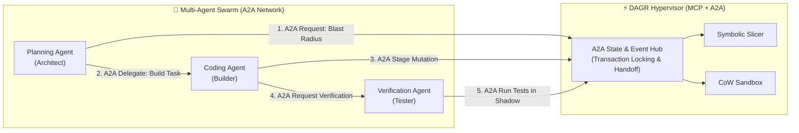
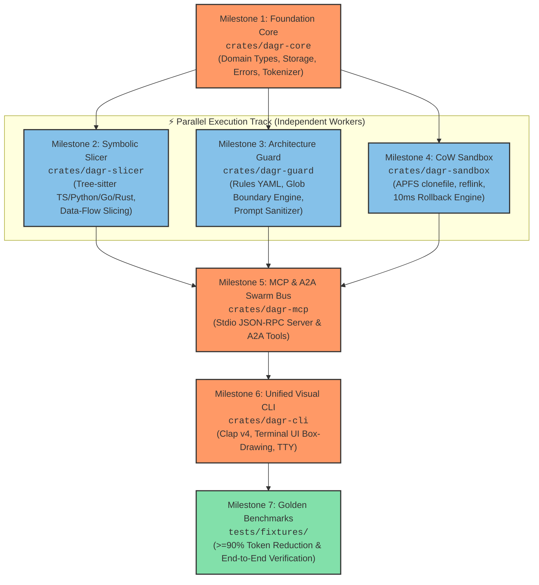

# ⚡ DAGR: Master Deterministic Architectural Specification & Implementation Blueprint

> **Project:** **DAGR** (`dagr`)  
> **Repository:** [`github.com/mjzd7/dagr`](https://github.com/mjzd7/dagr)  
> **Lead Architect:** Mohit Dagar  
> **Harness Mode:** `/hyperplan` + `/ultrawork`  
> **Governance:** [Ponytail Minimal Architecture (Full)](./.ponytail.md)  
> **Status:** All Architectural Decisions & MCP+A2A Protocol Finalized & Locked 🔒  
> **Last Audited:** 2026-08-18  

---

## 📑 Table of Contents
1. [Executive Summary & Core Philosophy](#1-executive-summary--core-philosophy)
2. [Dual Protocol Specification: MCP (Host-to-Tool) + A2A (Peer-to-Peer)](#2-dual-protocol-specification-mcp--a2a)
3. [The 7 Finalized Deterministic Architectural Decisions](#3-the-7-finalized-deterministic-architectural-decisions)
4. [Terminal Visual Design System & Aesthetics](#4-terminal-visual-design-system--aesthetics)
5. [Exhaustive 16-Point Edge-Case Register](#5-exhaustive-16-point-edge-case-register)
6. [Master Phase 1 Execution Roadmap & Checkable ToDo Breakdown](#6-master-phase-1-execution-roadmap)
7. [Parallel Execution Strategy for Subagents](#7-parallel-execution-strategy-for-subagents)
8. [Verification Harness & SLA Gateways](#8-verification-harness--sla-gateways)

---

## 1. Executive Summary & Core Philosophy

**DAGR** is an ultra-fast, local-first safety hypervisor, symbolic AST slicing engine, and multi-agent coordination bus built in native Rust. Its primary mission is to eliminate:
1. **Context Explosion (95% Token Bloat):** Passing giant files or noisy vector dumps to LLMs, inflating token bills and degrading model reasoning.
2. **Architectural Drift & Unbounded Blast Radius:** Autonomous AI agents generating duplicate utilities, violating clean layer boundaries, and executing destructive file mutations.
3. **Multi-Agent Collision & State Fragmentation:** Multiple autonomous agents clashing over the same working tree without coordinated state locks or verified handoffs.

---

## 2. Dual Protocol Specification: MCP + A2A

DAGR natively supports both the **Model Context Protocol (MCP)** for IDE integrations and the **Agent-to-Agent Protocol (A2A)** for autonomous multi-agent swarm coordination:

```
                              MCP vs. A2A PROTOCOL TOPOLOGY
                              
    ┌──────────────────────────────────────────────┐    ┌──────────────────────────────────────────────┐
    │        MCP (MODEL CONTEXT PROTOCOL)          │    │         A2A (AGENT-TO-AGENT PROTOCOL)        │
    │            "Host-to-Tool Interface"          │    │          "Peer Swarm Coordination"           │
    ├──────────────────────────────────────────────┤    ├──────────────────────────────────────────────┤
    │ • Client-Server (IDE ➔ DAGR)                 │    │ • Peer-to-Peer / Bus (Agent ➔ Agent)         │
    │ • Request/Response (JSON-RPC 2.0)            │    │ • State envelope sharing & delegation        │
    │ • Used by: Cursor, Claude Desktop, Windsurf  │    │ • Used by: Multi-agent swarms (Plan/Code/Test)│
    └──────────────────────────────────────────────┘    └──────────────────────────────────────────────┘
```



### The 6 Core Tools Exposed across MCP & A2A:

#### 🔌 Standard MCP Tools (Host-to-Tool):
1. `dagr_get_context_slice`: Prunes code down to exact ~35 lines + hoisted type contracts.
2. `dagr_verify_architecture`: In-memory layer boundary and SOLID checker (<0.1ms).
3. `dagr_execute_sandboxed`: Safe tool execution in Copy-on-Write shadow sandbox.

#### 🤝 A2A Swarm Tools (Peer-to-Peer):
4. `dagr_a2a_handshake`: Registers agent session ID, role, and file locks (prevents concurrent write conflicts).
5. `dagr_a2a_transfer_context`: Passes compressed AST slices directly between peer agents without re-parsing.
6. `dagr_a2a_verify_peer_patch`: Reviewer agent runs automated tests on another agent's staged shadow transaction (`tx_id`) before committing.

---

## 3. The 7 Finalized Deterministic Architectural Decisions

1. **Tree-sitter Grammar Ingestion:** Static native C compilation for TS, JS, Python, Go, Rust with `cargo-zigbuild` CI + fallback to Indentation/Regex.
2. **Symbolic Slicing Algorithm:** Backwards Data-Flow Slicing with Contract Hoisting (>= 90% token reduction).
3. **CoW Shadow Sandbox:** OS-Native block cloning (`clonefile(2)` on macOS, `reflink` on Linux, hardlink staging) with sub-10ms atomic rollback.
4. **Local Storage & Cache:** Embedded SQLite with Write-Ahead Logging (`PRAGMA journal_mode = WAL;`) + 32-byte Blake3 content hash indexing.
5. **Protocol Gateway:** Stdio + SSE JSON-RPC 2.0 with global stdout isolation (logs to stderr).
6. **Architectural Guardrails:** 3-Pillar Hybrid Engine (Auto-Detection, Presets, `.dagr/rules.yaml`, Prompt Sanitizer).
7. **CLI & Terminal Aesthetics:** Clap v4 subcommands with colored Unicode scoreboards, progress bars, and TTY auto-detection.

---

## 4. Terminal Visual Design System & Aesthetics

```
$ dagr context src/billing/charge.ts:processPayment

⚡ DAGR Symbolic AST Slicer v0.1.0
┌────────────────────────────────────────────────────────────────────────┐
│ Target Symbol:   src/billing/charge.ts:processPayment                  │
│ Language:        TypeScript (Tree-sitter native AST)                  │
│ Sliced Context:  34 lines (down from 1,180 lines in file)              │
│ Token Footprint: 342 tokens (down from 11,840 tokens)                  │
│ Token Reduction: [████████████████████████████░░] 🟢 97.1% COMPRESSED   │
│ Latency:         ⚡ 1.8ms (Blake3 SQLite Index HIT)                     │
└────────────────────────────────────────────────────────────────────────┘
```

---

## 5. Exhaustive 16-Point Edge-Case Register

| ID | Edge Case | Severity | Concrete Mitigation |
| :--- | :--- | :---: | :--- |
| **E01** | Mid-edit Syntax Errors (missing brackets) | 🔴 High | Tree-sitter error recovery + Lexical Indentation Fallback (`syntax_degraded: true`). |
| **E02** | Circular AST Dependencies (`A -> B -> A`) | 🔴 High | `HashSet<u64>` visited register + iterative BFS queue + 3-hop depth limit. |
| **E03** | Indirect Prompt Injection in Comments | 🔴 High | Zero-trust regex sanitizer stripping `<|im_start|>`, `SYSTEM:`, `[INST]` delimiters. |
| **E04** | Path Traversal (`../../etc/passwd`) | 🔴 High | Path canonicalization (`std::fs::canonicalize`) enforcing workspace root prefix. |
| **E05** | Process Crash during Shadow Mutation | 🟡 Med | Write-ahead journal (`.dagr/journal.db`) auto-rolling back orphan locks on boot. |
| **E06** | Cross-Platform CoW Compatibility | 🔴 High | Dynamic selector: `clonefile` on Darwin, `reflink`/hardlinks on Linux/Windows. |
| **E07** | Dynamic Metaprogramming (`eval`, `getattr`) | 🟡 Med | Capture lexical enclosing boundary box + attach `unresolved_dynamic_call` warning. |
| **E08** | Massive Monorepos (10M+ LOC) | 🟡 Med | Lazy on-demand AST parsing + LRU mmap cache + git-diff scoped indexing. |
| **E09** | Git Pre-commit Latency Breaches (>100ms) | 🟡 Med | Blake3 hash caching skipping unchanged files (<35ms total hook run). |
| **E10** | MCP Stdio Stream Corruption | 🔴 High | Strict `tracing-subscriber` routing all logs to `stderr`; `stdout` reserved for JSON-RPC. |
| **E11** | BPE Token Count Distortion in Code | 🟢 Low | Native `tiktoken-rs` (`cl100k_base` / `o200k_base`) for exact audited metrics. |
| **E12** | Cross-Language Boundaries (TS -> Rust API) | 🟡 Med | OpenAPI/Protobuf contract registry mapping HTTP routes to server handler ASTs. |
| **E13** | Concurrent Multi-Agent Invocations | 🟡 Med | A2A state locking + UUID-keyed shadow namespaces (`.dagr/shadow/<tx_id>`). |
| **E14** | Binary & Non-UTF8 Files (.png, .wasm) | 🟢 Low | MIME sniffing + UTF-8 validation gate rejecting non-text files instantly. |
| **E15** | Layer Boundary Violations | 🔴 High | In-memory AST import linter (`dagr guard`) evaluating `.dagr/rules.yaml`. |
| **E16** | Downstream LLM Outages & Drops | 🟡 Med | Circuit Breaker state machine (Closed -> Open -> Half-Open) with exponential backoff. |

---

## 6. Master Phase 1 Execution Roadmap



### 📍 Milestone 1: Cargo Workspace & Foundation Core (`crates/dagr-core`) [SEQUENTIAL]
- [ ] Task 1.1: Root `DAGR/Cargo.toml` workspace setup.
- [ ] Task 1.2: Typed `DagrError` using `thiserror`.
- [ ] Task 1.3: `Language`, `SymbolKind`, `CodeGraphNode`, `MinimalContextSlice` types.
- [ ] Task 1.4: `tiktoken-rs` exact BPE token counter.
- [ ] Task 1.5: Embedded SQLite store with WAL mode and Blake3 hash caching.

### 📍 Milestone 2: Symbolic Slicer Engine (`crates/dagr-slicer`) [PARALLEL TRACK A]
- [ ] Task 2.1: Native Tree-sitter parsers (TS, JS, Python, Go, Rust) with error recovery.
- [ ] Task 2.2: AST identifier and symbol extractors.
- [ ] Task 2.3: Type contract & interface hoister.
- [ ] Task 2.4: Backwards data-flow slicer assembling sparse lines.

### 📍 Milestone 3: Architecture Guardrails & Sanitizer (`crates/dagr-guard`) [PARALLEL TRACK B]
- [ ] Task 3.1: `.dagr/rules.yaml` parser with built-in presets (`clean-architecture`, `nextjs`, `fastapi`).
- [ ] Task 3.2: Glob-based import boundary matcher (<0.1ms per file).
- [ ] Task 3.3: Zero-trust indirect prompt injection sanitizer.
- [ ] Task 3.4: Invariant auto-detection engine (`dagr rules suggest`).

### 📍 Milestone 4: Cross-Platform CoW Sandbox (`crates/dagr-sandbox`) [PARALLEL TRACK C]
- [ ] Task 4.1: Cross-platform CoW engine (`clonefile` on macOS, `reflink`/hardlink on Linux/Windows).
- [ ] Task 4.2: Shadow transaction manager (`begin`, `stage_write`, `verify`, `commit`, `rollback`).
- [ ] Task 4.3: Crash-safe write-ahead transaction journal (`.dagr/journal.db`).

### 📍 Milestone 5: MCP & A2A Swarm Bus (`crates/dagr-mcp`) [SEQUENTIAL INTEGRATION]
- [ ] Task 5.1: JSON-RPC 2.0 protocol schemas (`initialize`, `tools/list`, `tools/call`).
- [ ] Task 5.2: Stdio event loop with `tracing-subscriber` log isolation to `stderr`.
- [ ] Task 5.3: MCP tool handlers (`dagr_get_context_slice`, `dagr_verify_architecture`, `dagr_execute_sandboxed`).
- [ ] Task 5.4: A2A swarm tool handlers (`dagr_a2a_handshake`, `dagr_a2a_transfer_context`, `dagr_a2a_verify_peer_patch`).

### 📍 Milestone 6: Unified Visual CLI & Terminal UI (`crates/dagr-cli`) [SEQUENTIAL INTEGRATION]
- [ ] Task 6.1: Clap v4 command parser (`context`, `guard`, `run`, `mcp`, `init`, `graph`).
- [ ] Task 6.2: Terminal UI box-drawing, colored token scoreboards, and TTY auto-detection.
- [ ] Task 6.3: Subcommand dispatchers and Git hook installer.

### 📍 Milestone 7: Golden Benchmark Suite & End-to-End Verification [FINAL GATE]
- [ ] Task 7.1: Real-world TypeScript, Python, and Go test fixtures.
- [ ] Task 7.2: Assert `>= 90%` token compression, `< 35ms` pre-commit latency, and 100% clean rollback.
- [ ] Task 7.3: Commit and tag v0.1.0 release on GitHub.

---

## 7. Parallel Execution Strategy for Subagents

```text
[Step 1]: Lead Agent implements Milestone 1 (`crates/dagr-core`) -> Compiles & Tests.
[Step 2]: Lead Agent spawns 3 Concurrent Subagents:
          ├── Subagent A (Role: "Slicer Specialist")   -> Implements Milestone 2 (`crates/dagr-slicer`)
          ├── Subagent B (Role: "Security & Guard")   -> Implements Milestone 3 (`crates/dagr-guard`)
          └── Subagent C (Role: "CoW Sandbox Lead")    -> Implements Milestone 4 (`crates/dagr-sandbox`)
[Step 3]: Subagents report back. Lead Agent validates all 3 crates compile concurrently.
[Step 4]: Lead Agent implements Milestone 5 (`crates/dagr-mcp`) & Milestone 6 (`crates/dagr-cli`).
[Step 5]: Run Milestone 7 Benchmark Suite -> Verify 100% Green -> Push to GitHub.
```

---

## 8. Verification Harness & SLA Gateways

| Metric | Target SLA | Verification Method |
| :--- | :---: | :--- |
| **Token Compression** | **>= 90%** (Target: 95%) | `tiktoken-rs` audited token comparison on golden fixtures |
| **AST Parse & Slice Latency** | **< 5ms** (Cold) / **< 0.5ms** (Cached) | In-memory timer benchmark on 1,000-line ASTs |
| **Pre-commit Guard Latency** | **< 35ms** | `dagr guard` execution across 50 staged files |
| **Rollback Execution Time** | **< 10ms** | Time to purge `.dagr/shadow/<tx_id>` snapshot |
| **Working Tree Cleanliness** | **100% (0 residual bytes)** | `git status --porcelain` assertion after failed sandbox runs |
